# Credit Risk Dataset Exploration — Standalone Narrative

This is a self‑contained report that consolidates the most useful exploratory analyses for the accepted‑loans dataset (2007–2018). It includes class balance, missingness, distributions, feature–target relationships (correlation and mutual information), temporal drift (PSI), and a leakage audit. All figures referenced here are copied under `docs/exploration/figures/` so this document remains stable even if local run folders are cleaned.

## TL;DR
- Data scale: 1,271,779 loans; ~1.64 GB in memory; 51 numeric and 21 categorical columns.
- Positive class is 0 = Charged Off; overall positive rate 19.76%.
- Defaults rise from ~12–16% (2009–2013) to ~23% (2016–2017), then dip in 2018 (right‑censoring/volume drop).
- Strong leakage exists in raw data (payments, recoveries, last payment dates, hardship/settlement); these must be excluded for origination‑time modeling.
- Origination‑time signal: FICO (avg/low/high) is the strongest anti‑correlate; DTI and utilization are positively associated with default; term (60 months) is much riskier than 36 months; purpose and home ownership stratify risk.
- Drift: several credit‑depth features and date‑like categoricals exhibit large PSI between early (≤2016‑06) and late (≥2016‑07) cohorts; validate with time‑based splits and monitor post‑deployment.
- Data quality: handle outliers (annual_inc to 10.9M; dti up to 999/−1; revol_util up to 892.3) with capping/cleaning.

---

## Exploration Strategy
Objective: provide a readable, decision‑ready overview for modeling at origination time.

Approach
- Time‑aware perspective: treat `issue_d` as the timeline; use early vs late cohorts to quantify drift.
- Leakage‑free view for modeling decisions; full view only to expose leakage risks.
- Rank features by both linear (correlation) and non‑linear (mutual information) signal.
- Favor human‑readable plots, long captions, and clear calls to action.

Assumptions and invariants
- Positive class is 0 = Charged Off (metrics and plots follow this).
- Thresholds should be chosen on validation from the training period (e.g., Youden’s J) and applied unchanged to test.
- Validation is carved from train before any oversampling; oversampling applies to train only.

---

## Class Balance Over Time
Default base rates shift materially across vintages — essential context for calibration and thresholding.

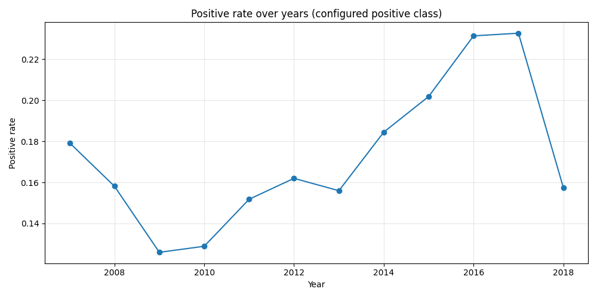
Caption: Default rate rises into 2016–2017 (~23%) and falls in 2018 (~15–16%), consistent with changing portfolio mix and right‑censoring for recent vintages.

Implications
- Always evaluate with time‑based splits.
- Expect different optimal thresholds across vintages; lock the threshold from validation and report test metrics at that fixed point.

---

## Right‑Censoring and “Current” Loans
Recent vintages contain many loans that have not reached a final outcome yet (right‑censoring). Treating these as non‑defaults would bias results.

Key findings (full accepted‑loans CSV, processed in one pass)
- Total loans: 2,104,542
- Final statuses kept: 1,271,779 (Fully Paid 1,020,444; Charged Off 251,335)
- Non‑final dropped: 832,763 → 39.57% of rows (e.g., Current 799,583; Late/Grace 30,373 combined)

Concentration of “Current” in recent periods
- 80th‑percentile time cutoff by `issue_d`: 2018‑03‑01. In the last period, 88.11% of loans are “Current”. Earlier periods: 25.27% “Current”.
- By year (share Current): 2014 5.06%, 2015 10.28%, 2016 27.24%, 2017 58.08%, 2018 86.26%.

Mitigation in this project
- Label policy: keep only final outcomes. We explicitly map `Charged Off → 0` and `Fully Paid → 1` and drop all other statuses (e.g., Current, Late, In Grace Period) at load time.
- Leakage controls: drop post‑origination fields (payments, recoveries, last_* dates, hardship/settlement) so no overdue/collection signals leak into training.
- Evaluation: time‑based split by `issue_d`; choose threshold on validation from the training period; report fixed‑threshold metrics on the held‑out test period.

Notes
- This conservative policy yields clean labels but removes many recent loans. If needed later, we can add a “matured‑only” filter (keep loans with `issue_d + term <= snapshot`) or switch to survival models to use censored observations without mislabeling.

---

## Missingness and Leakage
Large blocks of near‑100% missingness indicate non‑origination operational fields (hardship/settlement/next payment). These are also post‑event and therefore leaky.

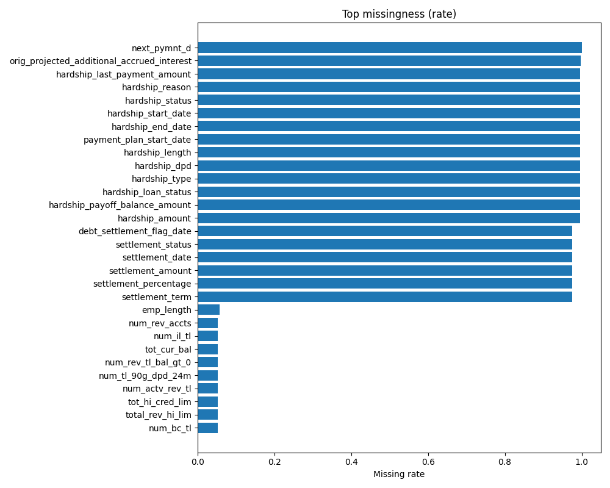
Caption: `next_pymnt_d` and nearly all `hardship_*` / `settlement_*` fields have ≈96–100% missingness. These should be dropped for origination‑time modeling.

Action
- Keep an explicit “leakage list” (payments, recoveries, last_* dates/amounts, hardship/settlement) and exclude them throughout preprocessing and selection.
- For model‑useful fields with moderate missingness (e.g., `emp_length` ~5.8%), encode an explicit Missing level.

---

## Numeric Distributions (Origination Focus)
Spot skew/outliers and visualize class separation to guide transforms and caps.

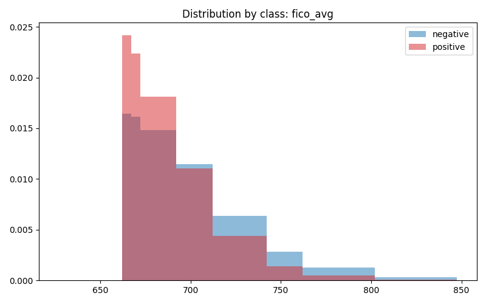
Caption: Charged‑off loans are shifted toward lower FICO; strong anti‑correlation with default risk.

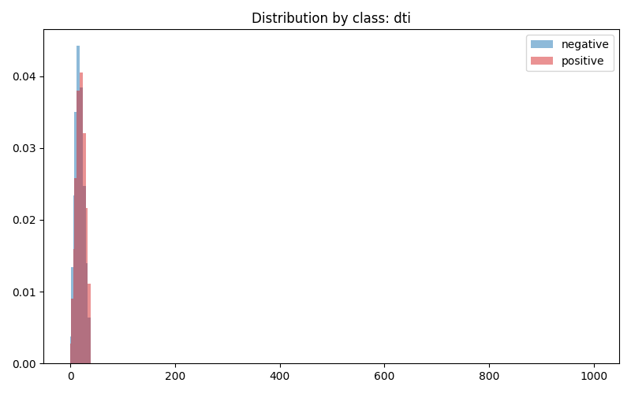
Caption: Heavy right tail with values up to 999 and a sentinel −1. Treat −1 as missing; cap top tail (e.g., 99) and consider log/robust scaling downstream.

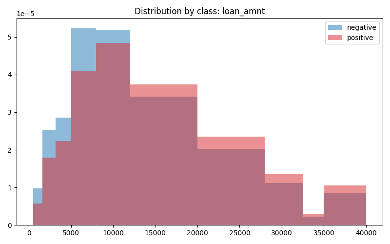
Caption: Primary origination bands $5k–$25k; weak marginal separation but interacts with income/term.

Data quality
- annual_inc up to 10,999,200 → winsorize/log.
- revol_util up to 892.3 → cap at 100 and treat excess as bad data.
- dti min −1, max 999 → convert −1 to missing; cap top tail.

---

## Categorical Profiles (Origination Focus)
Understand portfolio composition and per‑level risk.

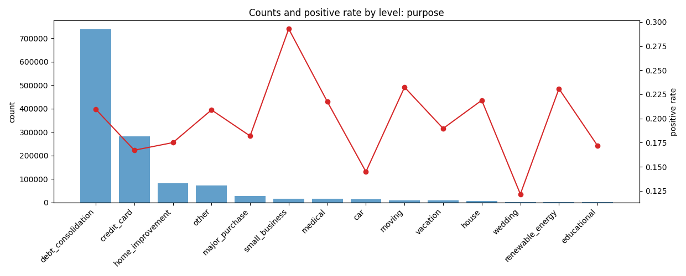
Caption: Volume dominated by debt_consolidation and credit_card. Higher default seen in small_business, moving; lowest in educational volume (small) and car.

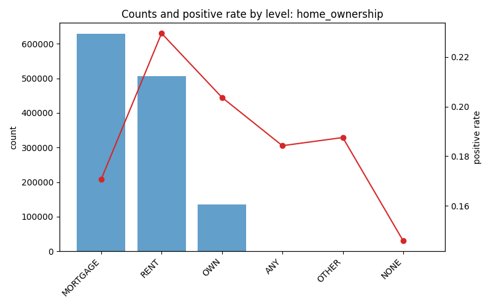
Caption: RENT tends to be riskier than MORTGAGE; OWN in between.

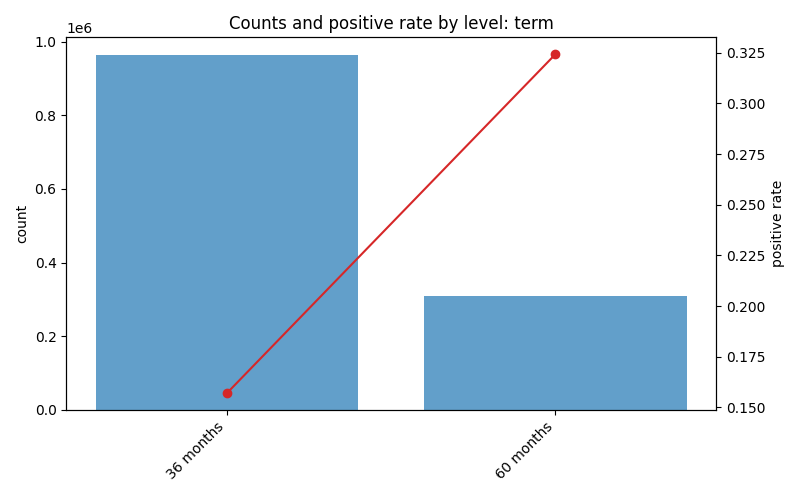
Caption: 60‑month loans show ~33% default vs ~15–16% for 36‑month — a major driver.

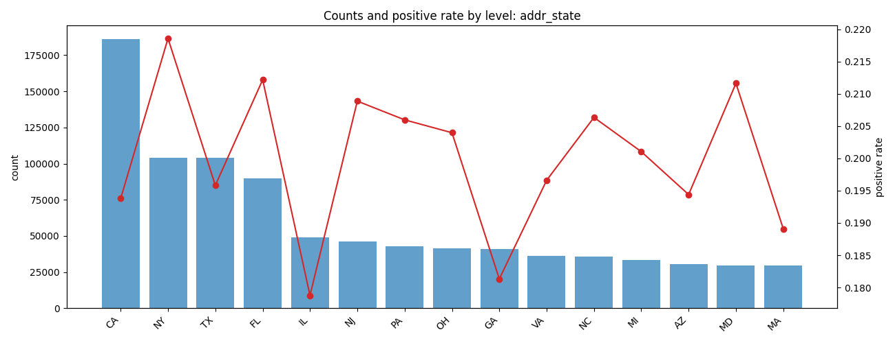
Caption: Volume concentrated in CA/NY/TX/FL; default rates vary within a narrow band (~18–21%) with outliers.

Encoding guidance
- One‑hot top K with “Other” for high‑cardinality (addr_state), or use regularized target encoding with time‑aware CV.
- Maintain explicit Missing levels where appropriate (emp_length).

---

## Credit Scores and Provider Grades
This section brings credit scores and LendingClub’s own grading scheme into focus. These variables are available at origination, but by project convention the default “provider‑agnostic” configuration excludes provider pricing/scoring fields (grade, sub_grade, int_rate, installment, funded_amnt) for portability. We analyze them here for completeness.

### FICO Credit Scores (included in origination view)
We explicitly examined FICO averages (and low/high ranges) — see the earlier histogram:

Caption: Lower FICO associates with higher default probability. FICO_* features are among the strongest origination‑time predictors (negative correlation around −0.13).

### LendingClub Grade and Sub‑grade (analyzed; excluded by default)

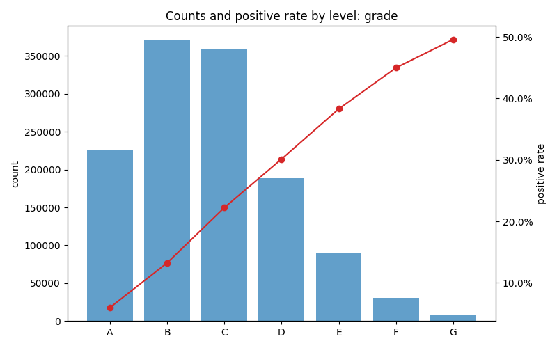
Caption: Default rate increases monotonically from A → G, matching risk expectations. Volume is concentrated in B–D grades.

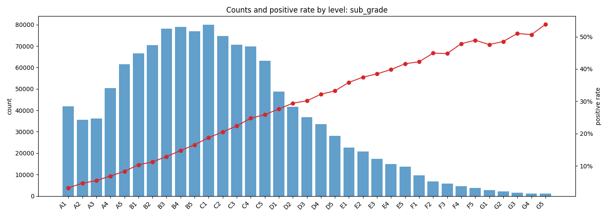
Caption: Within each grade, higher sub‑grades (e.g., C5 vs C1) trend to higher default rates. The pattern is smooth and strongly informative.

### Interest Rate (analyzed; excluded by default)

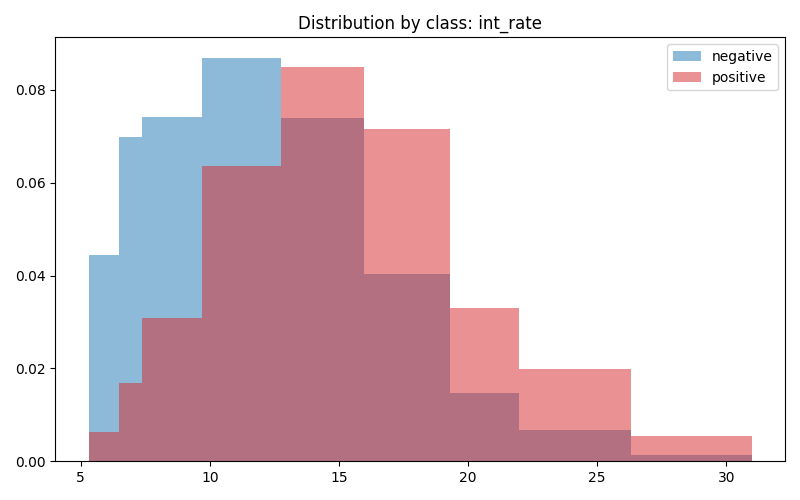
Caption: Higher interest rates are associated with higher default, reflecting pricing for risk.

Modeling guidance
- Provider‑agnostic runs: continue excluding `grade`, `sub_grade`, and `int_rate` to avoid baking in provider‑specific policy and pricing.
- Provider‑aware runs: include them (see `configs/provider_aware.yaml`) — they provide strong incremental signal and can materially improve AUC/PR but reduce portability.

---

### Other Provider‑Aware Fields (analyzed; excluded by default)

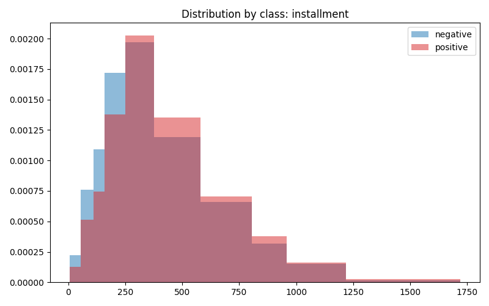
Caption: Higher scheduled installment payments tend to correlate with higher default risk, partly capturing loan size/term interactions.

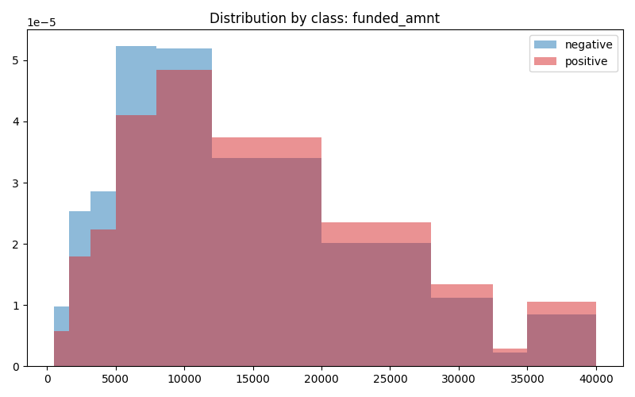
Caption: Larger funded amounts show slightly higher default probability in the tail. The effect is modest on a marginal basis but interacts with income and term.

Note: These fields (installment, funded_amnt) are informative but encode provider pricing and loan design; include them only in the provider‑aware configuration when portability is not a requirement.

---

### Signal Strength and Stability (Quantitative)
To clarify whether provider‑aware fields add value beyond FICO, we quantified their information content (mutual information, MI) and temporal stability (PSI; early ≤ 2016‑06 vs late ≥ 2016‑07). Higher MI indicates more predictive signal; PSI > 0.25 indicates large drift.

- Mutual information (approximate from this dataset):
  - `int_rate` MI ≈ 0.040
  - `sub_grade` MI ≈ 0.037
  - `grade` MI ≈ 0.035
  - Reference origination‑only MIs: `fico_spread` ≈ 0.034, `term` ≈ 0.015, `fico_avg` ≈ 0.010
  - Finding: provider‑aware fields carry as much or more signal as the strongest pure‑origination features individually; they are not mere duplicates of FICO.

- PSI (stability across time cohorts):
  - `grade` PSI ≈ 0.015 (small), `sub_grade` PSI ≈ 0.035 (small)
  - `int_rate` PSI ≈ 0.127 (moderate drift; macro/policy sensitive)
  - Finding: grades are relatively stable over the split; interest rates shift with market and pricing conditions.

Modeling guidance (provider‑aware runs)
- Use either `sub_grade` (or `grade`) or `int_rate` to avoid redundancy; including all three adds little incremental value.
- Drop `installment` when `loan_amnt` + `term` (and `int_rate` if used) are present; it is mostly deterministic from these.
- Prefer `loan_amnt` over `funded_amnt` (highly collinear); include `funded_amnt` only if `loan_amnt` is absent.
- Monitor `int_rate` for drift (PSI ~0.13 here); recalibrate thresholds or retrain when distribution shifts materially.

Portability vs accuracy
- Provider‑agnostic: exclude provider pricing/scoring to keep models portable across lenders and stable across policy changes.
- Provider‑aware: include `sub_grade`/`int_rate` for higher in‑provider accuracy, with drift monitoring and periodic recalibration.

---

## Feature–Target Relationships

### Correlation (Origination‑Only Numeric)
Linear associations with the configured positive class (Charged Off).

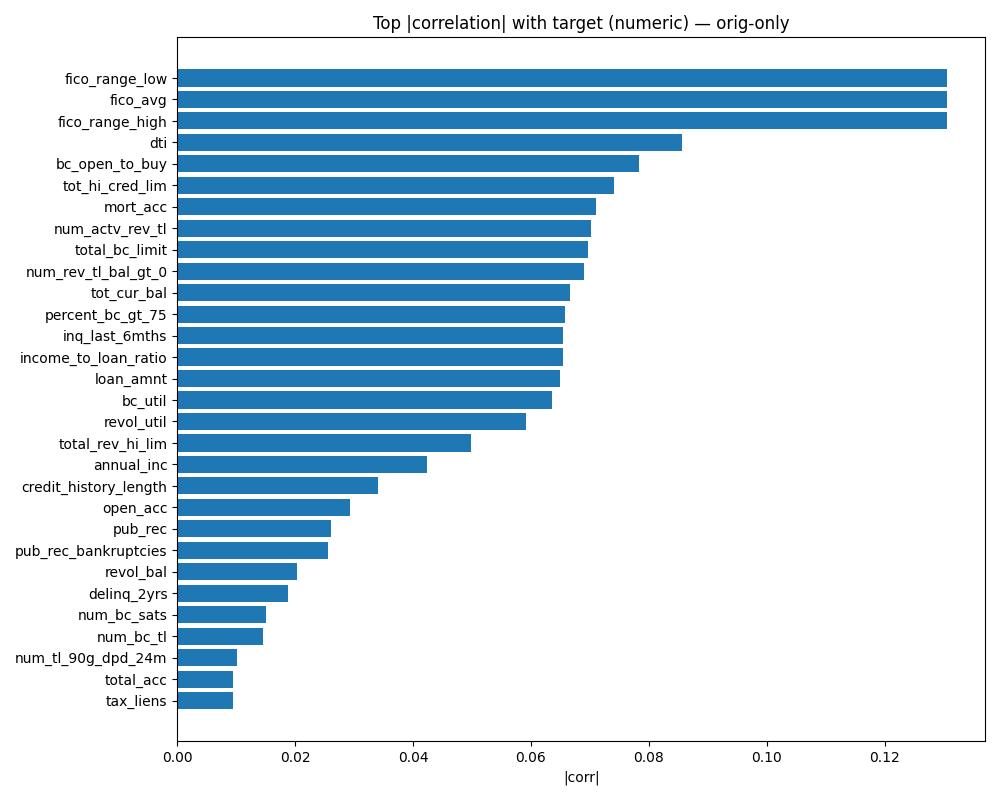
Caption: FICO measures (avg/low/high) are the strongest anti‑correlates (~−0.13). DTI and utilization are positively associated; credit‑depth/limit features add incremental signal.

### Correlation (All Numeric — Demonstrating Leakage)
Included only to expose leakage; do not use these features for modeling at origination.

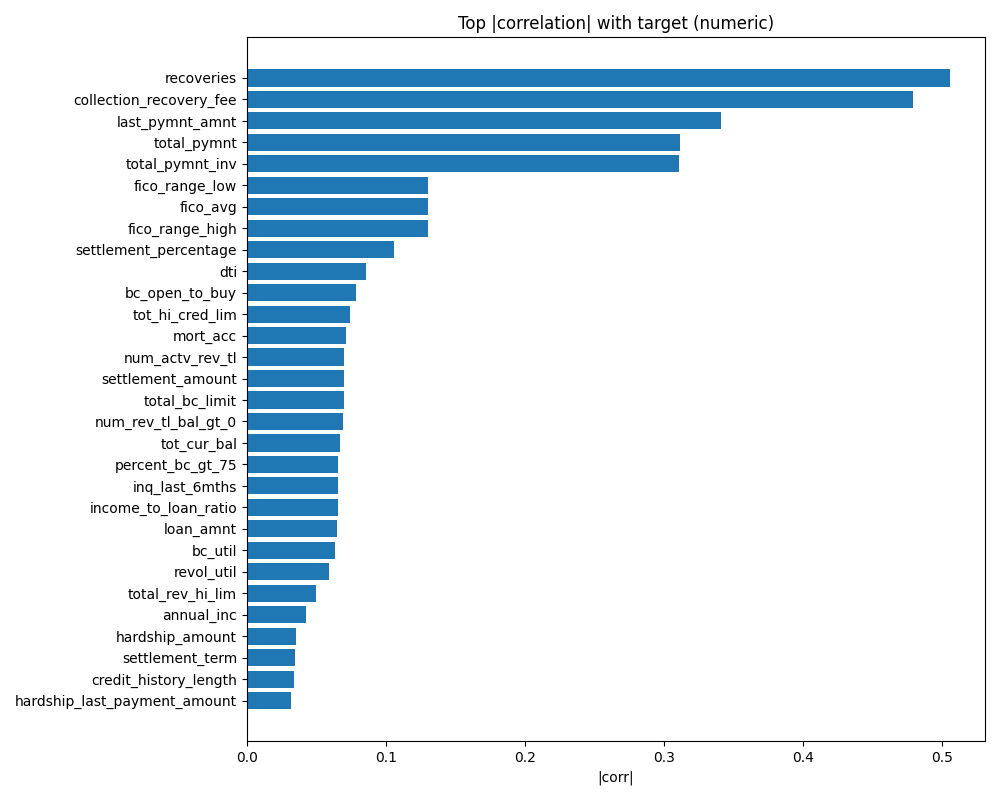
Caption: Payments/recoveries/last payment amount dominate. These encode outcomes and must be excluded.

### Mutual Information
Non‑linear dependency ranking (sampled 200k rows for tractability).
- Origination‑only: highest MI in `fico_spread`, `term`, `fico_avg`, `income_to_loan_ratio`, `loan_amnt`, plus inquiry and depth features — consistent with correlation findings but capturing some non‑linearities.
- Full (leaky) view: hardship/settlement/last payment features top the list and should be dropped.

---

## Temporal Drift (PSI)
Population Stability Index comparing early (≤2016‑06) vs late (≥2016‑07) cohorts. >0.25 indicates large drift.

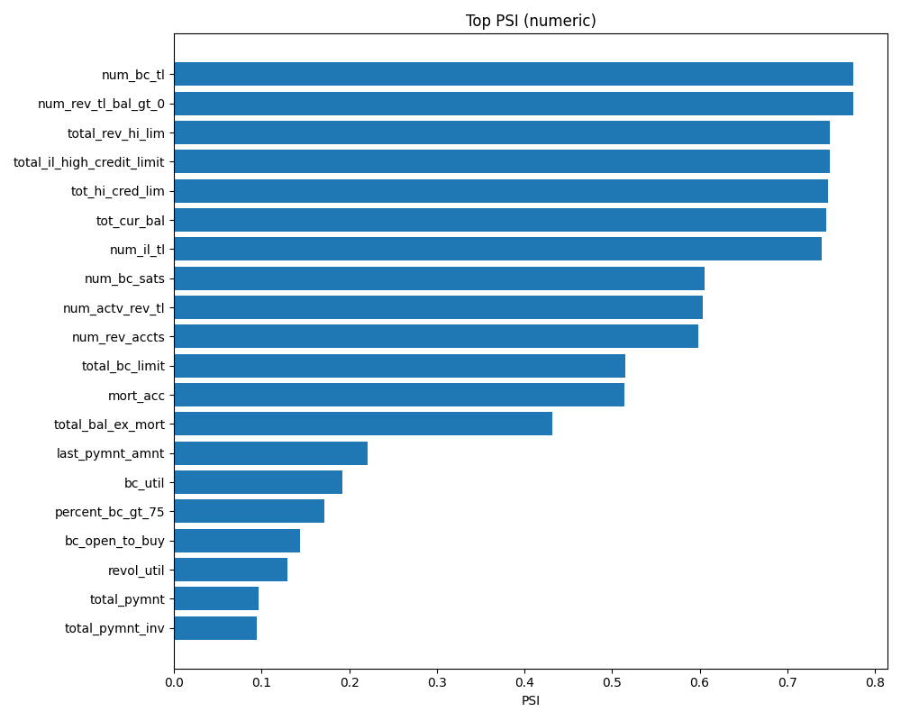
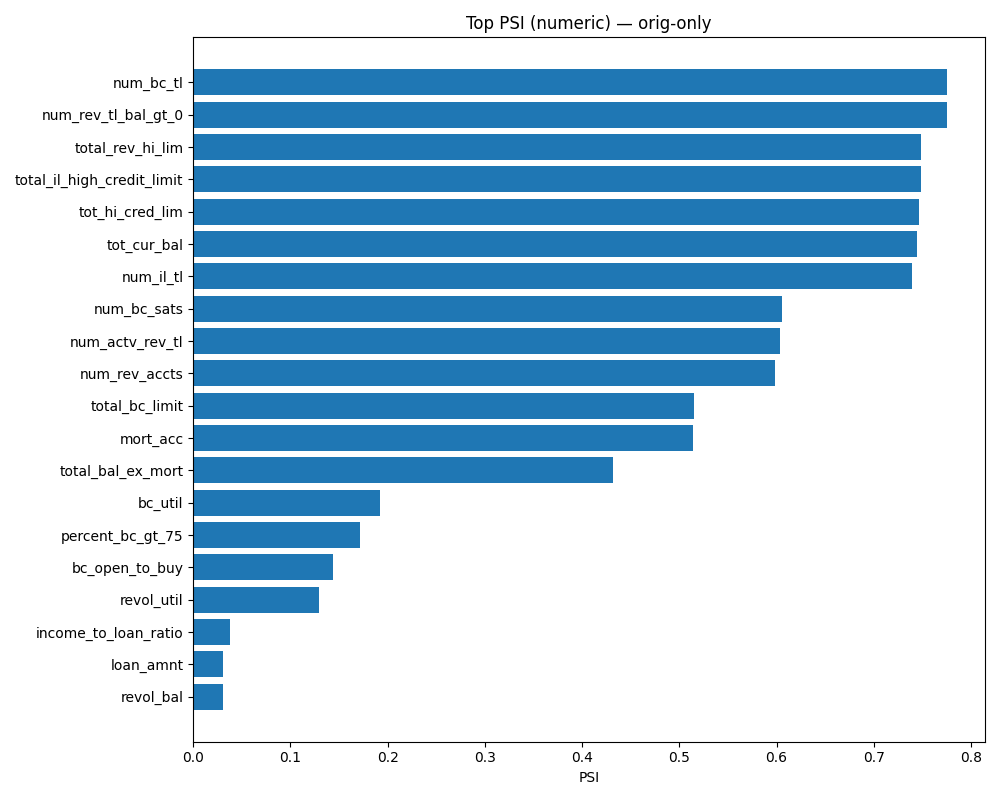
Caption: Credit‑depth features (counts/limits/balances) shift substantially across time, reflecting portfolio and macro changes.

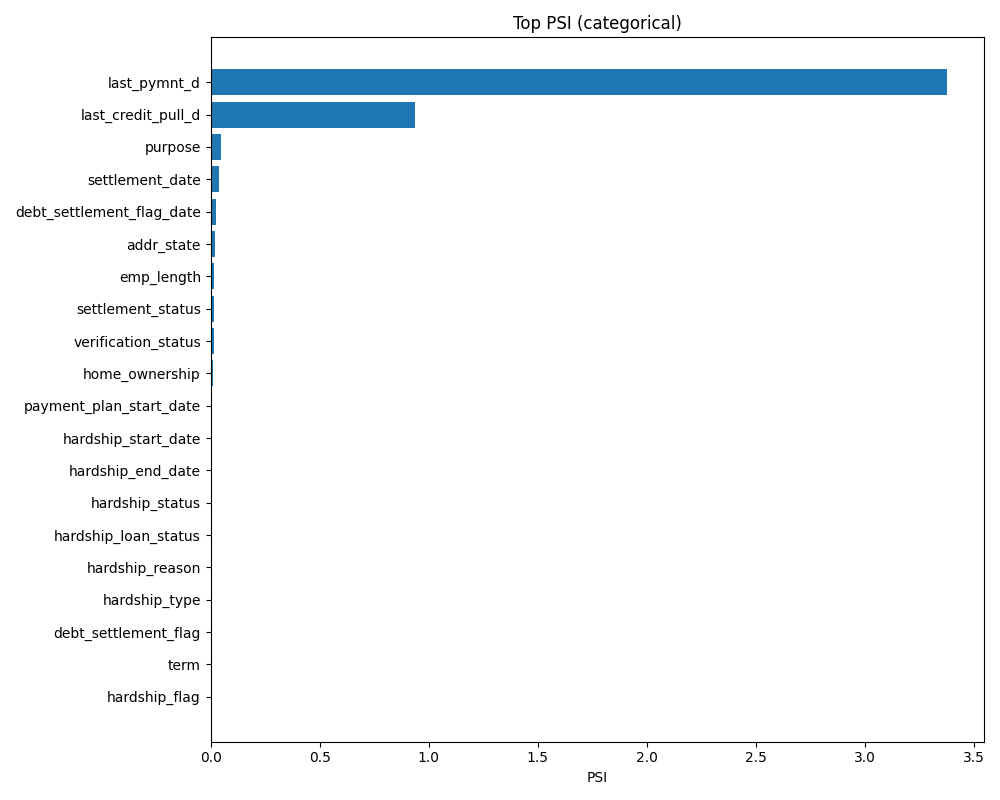
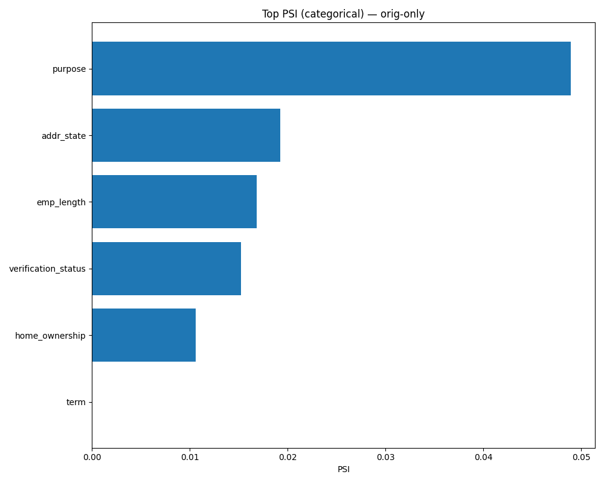
Caption: `last_pymnt_d` and `last_credit_pull_d` show extreme PSI (and are leaky). Among origination‑time fields, `purpose` shows modest drift; others are relatively stable.

Implications
- Use strict time‑based validation.
- Monitor PSI and recalibrate thresholds when drift is large; consider periodic re‑training.

---

## Leakage Audit (Explicit)
Categories to exclude from origination‑time models:
- Payments and recoveries: `total_pymnt`, `total_pymnt_inv`, `last_pymnt_amnt`, `collection_recovery_fee`, `recoveries`.
- Post‑event dates: `last_pymnt_d`, `next_pymnt_d`, `last_credit_pull_d`.
- Hardship and settlement families: all `hardship_*`, `debt_settlement_*`, `settlement_*`.

Rationale: These fields reflect outcomes after origination and produce unrealistically high apparent performance if included.

---

## Practical Recommendations
- Preprocessing: cap/winsorize outliers; log‑scale monetary amounts; add missing‑indicators; group rare categories.
- Features to prioritize: FICO (avg/low/high), DTI, term, income_to_loan_ratio, loan_amnt, credit‑depth/limits, utilization; include engineered features (credit_history_length, fico_spread).
- Evaluation: keep time‑split; choose threshold on validation (Youden’s J or F1 per business need); report test metrics at that fixed threshold.
- Monitoring: track base rate and PSI per vintage; re‑fit or recalibrate if PSI > 0.25 or base rate shifts >3–5pp.

---

## Notes on Reproducibility
Numbers and plots reflect the full accepted‑loans dataset (2007–2018). If the underlying CSV or feature list changes, regenerate figures and copy them into `docs/exploration/figures/` to keep this document self‑contained.
