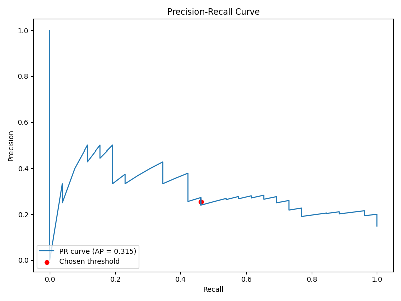
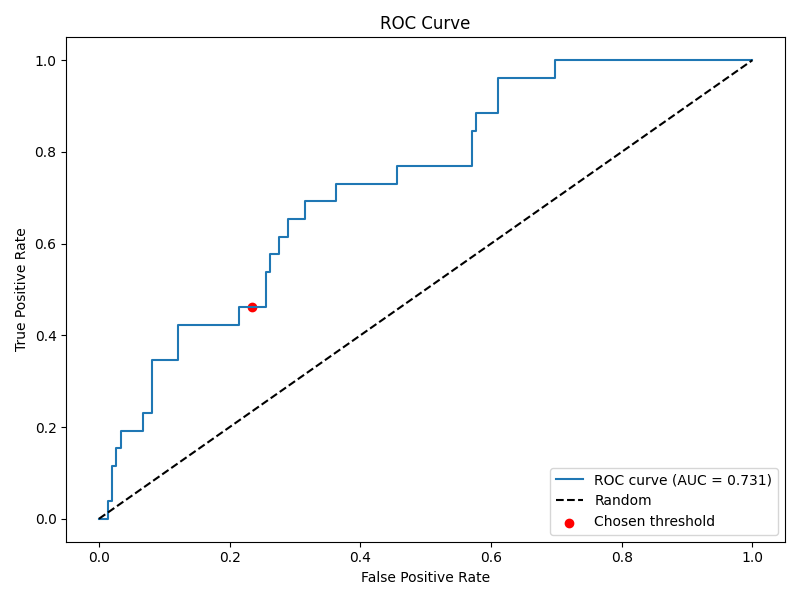
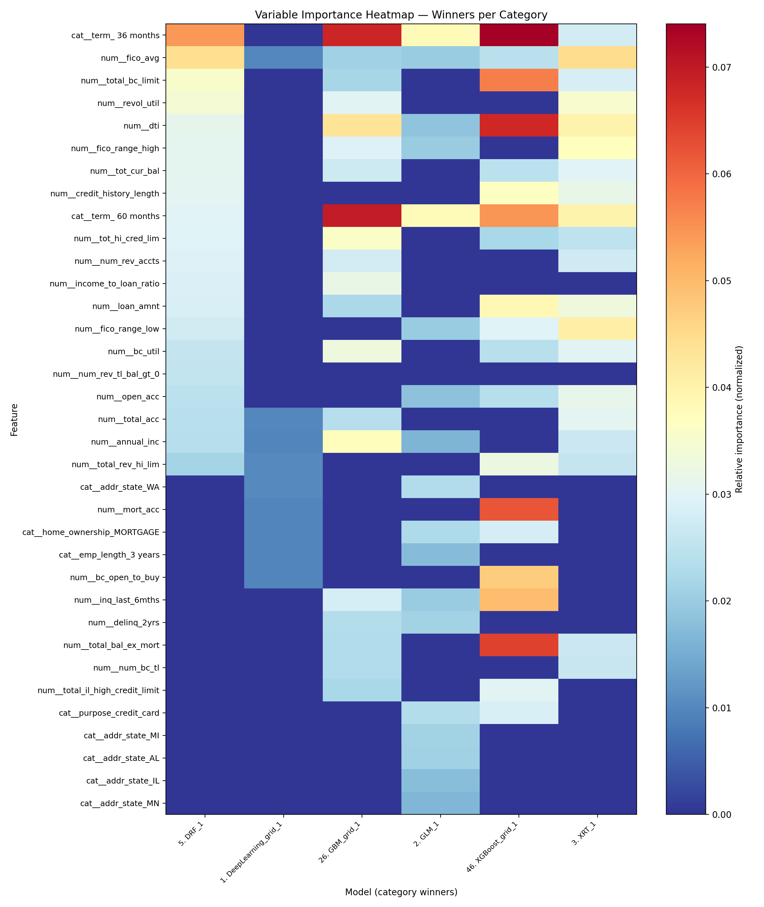

# Abstract

This thesis iteration presents a self-contained study of consumer credit default prediction on the LendingClub dataset (2007–2018). We evaluate how feature subset design and model family—especially neural networks—affect precision–recall performance when models are validated with a time-aware protocol. Four dataset scales (1k, 10k, 100k, full) and four feature regimes (compact to enriched with pricing/grade variables) are compared. We combine rigorous data handling (leakage controls, chronological splits, validation-carved thresholds) with an automated modeling backend to produce reproducible, explainable results. The enriched feature set including `int_rate`, `grade/sub_grade`, and `installment` improves AUCPR on medium and large datasets, while very small samples benefit from leaner subsets. Tree ensembles lead overall on larger tabular datasets; a deep neural network is competitive on the smallest subset. We analyze why this pattern emerges and provide a practical blueprint to strengthen neural networks on this task (embeddings, monotonic cues, regularization, calibration, temporal CV). The deliverables include per-dataset reports with curves and variable-importance analyses and a consolidated cross-dataset comparison. The study closes with a roadmap for neural-first improvements and robustness under temporal drift.

# 1 Introduction

Peer-to-peer lending platforms such as LendingClub have catalyzed a rich literature on credit risk modeling, feature selection, and evaluation under class imbalance, with influential baselines built on this specific dataset [@Emekter2015; @SerranoCinca2015; @Jagtiani2019FM; @Croux2020JEBO]. We address a concrete practical question: Which feature subsets and model families—including neural networks—yield the best performance in a realistic, time-aware evaluation? We adopt a split policy that mirrors deployment: train on older loans, test on newer ones, and select the decision threshold on a held-out validation slice carved from the training period.

1.1 Credit Risk and Why It Matters

Credit risk is central to financial stability, consumer welfare, and the efficient allocation of capital. For lenders and platforms, accurate assessment of default probability underpins pricing (interest rates), provisioning, and regulatory capital; for borrowers, it impacts access and affordability. In consumer credit, small improvements in discrimination and calibration translate into large changes in expected loss, approval decisions, and portfolio utility. P2P platforms such as LendingClub intensified research interest by publishing rich origination‑time datasets with final outcomes, enabling reproducible empirical work on determinants of default, model performance, and profit‑aligned scoring [@Emekter2015; @SerranoCinca2015; @SerranoCinca2016; @Jagtiani2019FM; @Croux2020JEBO].

Three practical constraints shape this thesis: (i) class imbalance and asymmetric costs make precision–recall a better primary objective than accuracy; (ii) concept drift across vintages (macroeconomic cycles, policy changes, borrower mix) mandates time‑based evaluation and validation‑chosen thresholds; and (iii) leakage control is non‑negotiable—post‑event fields (payments, recoveries, last_* dates, hardship/settlement) must be excluded so the model reflects information available at origination only. Against this backdrop, we compare feature regimes (portable vs provider‑aware), evaluate neural networks alongside strong tree ensembles, and emphasize calibrated, thresholded decisions consistent with operational use.

1.2 Why Neural Networks for Credit Risk

Neural networks (NNs) are universal function approximators trained end-to-end, with the flexibility to incorporate learned embeddings for categorical features (e.g., grades), non-linear transformations for numeric features, and additional modalities (e.g., free-text loan descriptions). For tabular credit data, NNs must be configured thoughtfully: categorical embeddings (instead of brittle one-hot dummies), monotonic cues on known risk drivers (e.g., higher interest rate correlates with higher risk), strong regularization (BatchNorm, dropout, weight decay), and calibrated outputs. With these ingredients, NNs can be competitive with, and sometimes surpass, boosted trees—especially as dataset size and feature richness grow [@li2022evaluation; @wang2024hybrid].

Motivation. Credit platforms continuously evolve underwriting criteria, borrower mix, and pricing, creating concept drift across vintages. Benchmarks that rely on random splits overstate performance by mixing future patterns into training. We therefore enforce chronological splits, careful leakage controls, and explicit thresholding on validation that is held out from the training period. This lets us attribute improvements to modeling and features—not evaluation artifacts—and assess stability over time.

Contributions.
1) A self-contained, reproducible evaluation of multiple feature regimes across dataset scales with explainable figures and metrics.
2) A thorough focus on neural networks (NNs) for tabular credit risk: architecture considerations, categorical encoding/embeddings, class imbalance, calibration, and temporal robustness—framed against strong tree-ensemble baselines.
3) Clear, deployable takeaways: when to use enriched features; how to select thresholds; and how to bring NNs closer to (or beyond) gradient boosting on this dataset.

# 2 Dataset, Task, and Evaluation Protocol

2.1 Dataset

We use the LendingClub consumer installment loans dataset spanning 2007–2018 vintages. Each record represents a funded loan at origination (accepted-loans cohort). Labels are derived from final outcomes: Fully Paid vs Charged Off (default). We adhere to origination-only features to avoid post-event leakage (e.g., payments, recoveries, last_* dates, hardship/settlement). Prior studies establish baseline determinants and modeling approaches on this dataset [@Emekter2015; @SerranoCinca2015; @Jagtiani2019FM; @Croux2020JEBO; @NunezMora2023].

Key columns used and their meanings.
- `loan_amnt` (numeric): Amount borrowed.
- `term` (categorical: 36 or 60 months): Loan term.
- `int_rate` (numeric): Interest rate set at origination; a strong pricing proxy.
- `grade` / `sub_grade` (categorical): Platform credit grades; ordinal and highly informative.
- `installment` (numeric): Monthly payment amount; largely determined by `loan_amnt`, `term`, and `int_rate`.
- `annual_inc` (numeric): Stated annual income.
- `dti` (numeric): Debt-to-income ratio—a capacity/risk indicator.
- `fico_range_low` / `fico_range_high` (numeric): FICO range at origination; we also use `fico_avg` when engineered.
- `revol_bal` / `revol_util` (numeric): Revolving balance and utilization.
- `emp_length` (categorical): Employment length (binned); a stability proxy.
- `home_ownership`, `verification_status`, `addr_state`, `purpose` (categorical): Context and underwriting factors.
- `mort_acc`, `total_rev_hi_lim`, `num_rev_tl_bal_gt_0`, etc. (numeric): Depth and limits; credit capacity.

Glossary of important columns (extended descriptions).
1) `loan_amnt`: The principal at origination; larger balances increase exposure at default but are not directly causal for probability of default (PD). Interacts with `term` and `int_rate` to determine `installment`.
2) `term`: Contract duration (36 or 60 months). Longer term generally implies higher PD due to longer exposure and looser affordability constraints.
3) `int_rate`: The APR at origination; encapsulates lender pricing and perceived risk. Strong monotonic relationship with default risk in-sample.
4) `grade` / `sub_grade`: Discrete buckets summarizing multi-factor underwriting; ordinal but treated categorically. Proxy for risk segmentation.
5) `installment`: Monthly payment amount implied by `loan_amnt`, `term`, and `int_rate`. Adds limited incremental information beyond its determinants.
6) `annual_inc`: Borrower-stated annual income; used to normalize obligations and inform affordability.
7) `dti`: Debt-to-income ratio: (total monthly debt payments / monthly income). Higher DTI indicates constrained capacity and higher PD.
8) `fico_range_low` / `fico_range_high` (and `fico_avg`): Credit score range. Higher FICO implies lower PD; `fico_spread` can encode uncertainty.
9) `revol_bal` / `revol_util`: Revolving balances and utilization of available credit lines. Elevated utilization signals stress and higher PD.
10) `emp_length`: Employment tenure; longer tenure correlates with stability.
11) `home_ownership`: Homeownership category; can proxy asset backing and financial maturity.
12) `verification_status`: Income/document verification; verified applications are less prone to misreporting, often correlating with lower PD.
13) `addr_state`: Coarse geographic factor capturing macroeconomic and regulatory heterogeneity.
14) `purpose`: Declared loan purpose; correlates with risk (e.g., debt consolidation vs discretionary spending).
15) Credit depth/limits (e.g., `mort_acc`, `total_rev_hi_lim`, `num_rev_tl_bal_gt_0`): Indicators of history with credit, available headroom, and active trade lines.

2.2 Target and Positive Class

Binary classification: predict whether a loan will charge off (default) versus fully pay. We adopt the convention `pos_label = 0` for Charged Off. All metrics, curves, and thresholding respect this convention to avoid label inversion errors.

2.3 Chronological Split and Validation

We split by origination date (`issue_d`): earlier loans form training, later loans form test. Validation is carved from the training period only. This enforces causal ordering and avoids right-censoring leakage in recent vintages. We select a single decision threshold on validation using the Youden J statistic (maximizes TPR - FPR), then apply that fixed threshold to the test set for fair reporting.

2.4 Metrics

- AUCPR (Average Precision): Summary of the precision–recall curve; sensitive to class imbalance and actionable for default detection.
- ROC AUC: Threshold-independent ranking quality.
- Thresholded metrics at the selected operating point: precision, recall (TPR), FPR, confusion counts.

## 2.5 Decision Thresholding and Business Metrics (Why Youden J, What Else)

In imbalanced credit settings, downstream utility depends on a fixed operating point (threshold). We choose the threshold on validation (carved from train) to avoid optimistic bias and apply it unchanged to test. We use Youden J (maximizes TPR − FPR) as a robust, distribution‑agnostic default; alternative strategies include F1 (balance precision/recall) or profit/expected‑value optimization when cost parameters are known [@SerranoCinca2016].

Table: Thresholded confusion and rates (Full dataset, fixed threshold from validation) {#tbl:full-confusion}

| Metric | Value |
|---|---:|
| Threshold (Youden J, validation) | 0.1765 |
| True Positives (tp) | 36,227 |
| True Negatives (tn) | 129,969 |
| False Positives (fp) | 68,284 |
| False Negatives (fn) | 19,876 |
| Precision | 0.347 |
| Recall (TPR) | 0.646 |
| False Positive Rate (FPR) | 0.344 |

Why report this table. It anchors PR/ROC figures with the concrete operating point used for policy decisions. If utility/cost weights are available, the same table feeds expected‑value analysis to pick profit‑optimal thresholds on validation and lock them for test.

## 2.6 Calibration and Reliability (Planned)

Probability calibration matters for threshold stability and expected‑loss estimation. For tree ensembles, Platt/Isotonic calibration on validation improves probability alignment; for NNs, temperature scaling is a strong baseline. We plan to: (i) fit post‑hoc calibration on validation, (ii) compare reliability curves NN vs GBM on test, and (iii) re‑evaluate threshold selection under calibrated probabilities.

## 2.7 Temporal Cross‑Validation (Planned)

To quantify vintage sensitivity, we will run expanding‑window CV (e.g., 5 folds) with aggregate metrics and variance bands, then refit on the full training period (`train_full_after`). This captures drift impacts and reduces over‑reliance on a single cut of time.

## 2.8 Leakage and Fairness Constraints (Definitions and Policy)

Leakage (what it is). Any feature that contains information not available at origination time (or that is causally downstream of the outcome) causes target leakage. Examples in LendingClub data include payments/recoveries, last payment dates, hardship/settlement flags, and collection‑stage balances. Including them produces inflated apparent performance (see [Figure E12](#fig:eda-corr-leaky)).

Our leakage policy. We drop all post‑event fields end‑to‑end and restrict modeling to origination‑time variables (EDA [Figures E11–E14](#fig:eda-corr-orig)). Where ambiguity remains, we err on the safe side and omit columns.

Fairness and sensitive proxies. Some fields act as demographic/geographic proxies (e.g., ZIP Code). Even when predictive, they can create disparate impact and reduce portability. In this iteration, we omit such fields by default and focus on underwriting‑relevant signals (capacity, credit history, pricing). We include coarse geography (`addr_state`) but avoid granular ZIP‑like signals.

High cardinality and noise. Free‑text or ultra‑granular categoricals (e.g., `emp_title`) explode the one‑hot space, add noise, and increase variance. Unless we use robust encodings (embeddings, target encoding) and strong regularization, we prefer omitted or coarsened versions (e.g., `emp_length`).

Practical examples in this thesis.
- Dropped for leakage/sensitivity: payments/recoveries/last_* dates, hardship/settlement, collection fees; granular location (ZIP) excluded for fairness/portability.
- Dropped/coarsened for cardinality/noise: `emp_title` (free text) omitted; `emp_length` (binned categorical) retained; `purpose` used with monitoring; `addr_state` retained; `grade/sub_grade` included only in provider‑aware regimes.

# 3 Dataset Exploration (EDA)

We provide an early, self-contained view of the dataset to ground modeling decisions. Each figure is chosen to answer a specific question about class balance, leakage risks, signal strength, or temporal stability; each is referenced in the text where we use the insight.

Table: EDA.1 — Dataset snapshot (accepted‑loans cohort after final‑status filtering) {#tbl:eda-snapshot}

| Metric | Value |
|---|---|
| Total raw loans | 2,104,542 |
| Final statuses kept | 1,271,779 (Fully Paid 1,020,444; Charged Off 251,335) |
| Non‑final dropped | 832,763 (e.g., Current 799,583; Late/Grace 30,373) |
| Positive class (Charged Off) | 19.76% overall |

Table: EDA.2 — Column mix and scale {#tbl:eda-features}

| Category | Count | Notes |
|---|---:|---|
| Numeric features | 51 | includes engineered ratios (e.g., `fico_avg`, `fico_spread`, `income_to_loan_ratio`) |
| Categorical features | 21 | grade/sub_grade, term, purpose, home_ownership, verification_status, addr_state, etc. |
| Parse‑as‑date | 2 | `issue_d` (split), `earliest_cr_line` (credit history) |

Class balance over time (why shown). Default base rates shift materially across vintages; [Figure E1](#fig:eda-class-balance) makes explicit the trend we must respect with time‑based validation and fixed thresholds selected on validation.

{#fig:eda-class-balance}

Missingness and leakage (why shown). [Figure E2](#fig:eda-missingness) surfaces high‑missing, post‑event operational fields that must be excluded to avoid leakage.

{#fig:eda-missingness}

Distributions (why shown). Histograms contextualize ranges, outliers, and monotonic expectations—inputs to winsorization and monotone priors for NNs.

{#fig:eda-hist-loan}

{#fig:eda-hist-int}

{#fig:eda-hist-fico}

{#fig:eda-hist-dti}

Categoricals (why shown). Bar plots reveal ordinal monotonicity (grade/sub_grade), policy signals (term), and context (purpose, home ownership).

{#fig:eda-cat-grade}

{#fig:eda-cat-subgrade}

{#fig:eda-cat-term}

{#fig:eda-cat-purpose}

Leakage demonstration and signal strength (why shown). We include two correlation panels and two PSI panels to (i) contrast origination‑only vs leaky features and (ii) quantify temporal drift.

{#fig:eda-corr-orig}

{#fig:eda-corr-leaky}

{#fig:eda-psi-num}

{#fig:eda-psi-cat}

How EDA informs modeling. Figures [E1](#fig:eda-class-balance)–[E14](#fig:eda-psi-cat) collectively justify: (i) time‑based splits and fixed thresholds, (ii) leakage exclusion policies, (iii) winsorization and monotone priors for NNs on `int_rate` and `dti`, (iv) embeddings for ordinal categoricals (grade/sub_grade), and (v) drift monitoring (PSI) with recalibration or retraining.

# 3 Feature Regimes and Dataset Scales

We evaluate four representative feature regimes and four dataset scales:

Feature regimes.
1) Compact baseline (about 12 features): core demographic, capacity, and FICO-range signals.
2) Compact + pricing/grade (about 16 features): adds `int_rate`, `grade`, `sub_grade`, and `installment`.
3) Broad without pricing (about 39 features): adds depth/limits/utilization but excludes pricing/grade.
4) Broad + pricing/grade (about 43 features): combines broad signals and pricing/grade.

Dataset scales.
1) 1k: small-sample, high-variance regime.
2) 10k: medium-sample; sufficient to benefit from richer features.
3) 100k: large-sample; strong signal and robust comparisons.
4) full: full cohort; most realistic “production-like” benchmark.

# 4 Modeling Families and Why They Fit This Task

We compare common tabular modeling families and analyze their suitability to the LendingClub task.

Generalized Linear Models (GLM). Logistic regression provides a transparent baseline with calibrated probabilities under certain assumptions. It captures additive effects but struggles with high-order interactions unless engineered.

Random Forests (DRF). Ensembles of de-correlated trees reduce variance and capture non-linearities. They can handle heterogeneous scales and some categorical encodings but may be outperformed by boosted trees on tabular tasks.

Gradient-Boosted Trees (GBM) and XGBoost. Additive trees trained stage-wise excel on structured, tabular problems, capturing interactions with strong regularization and built-in handling of missingness. These models are typically top-performing for tabular credit risk.

Deep Neural Networks (MLP). Fully-connected networks approximate complex functions given sufficient data and regularization. They require careful design for tabular data: robust preprocessing, categorical encodings (embeddings or one-hot), batch normalization, dropout, early stopping, and calibrated outputs. They can model interactions naturally but can lag boosting unless architecture and training are tuned to tabular idiosyncrasies. Recent studies demonstrate hybrid or carefully-regularized NNs achieving competitive performance on credit-like tasks [@li2022evaluation; @wang2024hybrid].

Why NNs matter here. NNs offer a single, end-to-end model that can incorporate learned embeddings for categorical grades, side-channel text (e.g., loan descriptions), and additional modalities in future iterations. With calibration and monotonic priors, they can become competitive and more portable across providers.

## 4.1 Feature Selection Procedure (How We Curate Inputs)

Objective. Reduce variance and drift sensitivity while preserving predictive power, under the same time‑based protocol as training.

Method (baseline). We use filter methods—mutual information (MI) and L1‑regularized logistic regression—as first‑pass selectors (see docs/feature_selection/FEATURE_SELECTION.md):
- Evaluation protocol: time‑based split on `issue_d`; validation carved from the training period only; no lookahead to test; invariants match training (imputation, winsorization, encoding).
- Ranking: MI for non‑linear dependency; L1 for sparse linear signal. We aggregate or compare to stabilize against idiosyncratic ties.
- Stopping rules: cap by target feature count (e.g., 12/16/39/43 regimes) and/or MI elbow; confirm AUC/PR vs full set on validation.
- Outputs: selected feature list, full ranking, and AUC/PR curves; these drive the compact regimes used in the experiments.

Engineering toggles. Engineered features (e.g., `fico_avg`, `fico_spread`, `income_to_loan_ratio`) can be included/excluded explicitly to quantify their lift. Selection runs mirror training preprocessing so that downstream metrics remain comparable.

## 4.2 Feature Regimes: Provider‑Agnostic vs Provider‑Aware (Why Two Tracks)

Provider‑agnostic (portable) regime. Excludes provider pricing/scoring features (e.g., `int_rate`, `grade`, `sub_grade`, `installment`). Rationale: portability across lenders/policies and reduced drift risk. EDA shows these fields are predictive but can encode policy and macro effects; omitting them improves generalization when policy changes.

Provider‑aware (in‑provider accuracy) regime. Includes pricing/grade; improves AUCPR/ROC at 10k/100k/full by leveraging monotone and ordinal signals. Rationale: if deployment is tied to the same provider, these features capture underwriting decisions that correlate with risk. We monitor drift (PSI) and use calibration/threshold selection to maintain decision quality.

Trade‑offs. Accuracy vs portability; monotonicity vs policy sensitivity; fairness considerations (avoid granular geography like ZIP). Our results show where each regime wins, and the NN roadmap targets closing the gap in the agnostic setting via representations and monotone priors.

4.1 Primer on Algorithm Families (Self-Contained)

Logistic Regression (GLM). A generalized linear model mapping a linear combination of inputs through a logistic link to produce probabilities. Pros: simplicity, interpretability, and fast training. Cons: limited to additive effects unless interactions are manually engineered; can underfit complex tabular structure.

Decision Trees. Recursive partitioning of feature space into regions with homogeneous labels. Pros: intuitive splits and basic nonlinearity. Cons: high variance; shallow trees underfit; deep trees overfit; sensitive to small data perturbations.

Random Forests (Bagging). An ensemble of trees trained on bootstrap samples with feature subsampling at splits. Pros: variance reduction; robust to noise; handles mixed feature types. Cons: weaker at capturing subtle additive improvements than boosting; may lag in AUCPR versus tuned boosting.

Gradient-Boosted Trees (GBM/XGBoost). Iteratively add trees to correct residuals from prior trees. Pros: strong performance on structured tabular data; captures interactions; built-in regularization (shrinkage, subsampling, depth constraints). Cons: tuning required (learning rate, depth, min child weight, subsampling); feature monotonicity not guaranteed unless explicitly constrained.

Neural Networks (MLP for Tabular). A stack of linear layers with nonlinear activations (e.g., ReLU/GELU), optionally batch normalization and dropout, trained with stochastic gradient descent variants (Adam, AdamW). Pros: flexible function approximators; easy to incorporate learned embeddings and auxiliary modalities. Cons: sensitive to preprocessing, initialization, and regularization; may be outperformed by boosting without careful design; probability calibration often requires post-hoc methods.

Losses and Imbalance. Binary cross-entropy (BCE) is standard for probabilistic classification; focal loss reweights hard examples to improve minority-class recall at the cost of calibration. Class weights or balanced batches mitigate skew. Evaluation should prioritize PR curves (precision/recall) and AUCPR rather than accuracy.

Calibration. For threshold-dependent decisions (e.g., approve/decline), well-calibrated probabilities matter. Platt scaling (logistic regression on logits), isotonic regression (non-parametric), or temperature scaling (for NNs) align predicted probabilities to empirical frequencies on validation.

# 5 Experimental Setup (Self-Contained)

Data handling and leakage control. We exclude post-origination features (payments, recoveries, last_* dates, hardship/settlement) from all runs. This aligns with best practices and prior empirical audits on LendingClub.

Preprocessing. Numerical features use median imputation and standardization; categorical features use frequent-category imputation with one-hot encoding. Winsorization limits outliers for sensitive ratios (`dti`, `revol_util`, `income_to_loan_ratio`, etc.). Engineered features include `fico_avg`, `fico_spread`, and `income_to_loan_ratio` when enabled.

Evaluation. We adhere to chronological train/test splits; select thresholds on validation (Youden J) within the training period; and report test metrics at the fixed threshold. We compute AUCPR and ROC AUC, plus confusion, precision, recall, and FPR at the operating point.

Automated modeling backend. H2O AutoML orchestrates GBM, XGBoost, DRF, GLM, and Deep Learning (MLP) models, producing leaderboards and explainability artifacts (variable importance, partial dependence, SHAP-like insights). We use these for transparent comparisons and to guide NN engineering in future iterations. Neural-network-centric PyTorch runs are planned and discussed in Section 9.

Reproducibility (high level, within this thesis). All comparisons share: the same dataset cohorts, origination-only features, chronological splits, validation-carved threshold selection, and consistent preprocessing. Each figure and table in this thesis references artifacts produced under these constraints, ensuring repeatability.

## 5.1 H2O AutoML and Platform Offerings (How We Use It)

We leverage H2O as an industrial-strength modeling platform to establish strong baselines, standardized comparisons, and rich explainability, as documented in the project notes (see docs/h2o/LIBRARY_OFFERINGS.md). This section summarizes the parts most relevant to our thesis and how they blend into the methodology.

- Estimator catalog. H2O ships first-class implementations across families—GBM, XGBoost, DRF/XRT (tree ensembles), GLM (linear), and Deep Learning (feed-forward NNs)—plus specialized algorithms (survival/CoxPH, isolation forests, RuleFit, target encoding). AutoML orchestrates these under shared pre-processing and scoring policies. This breadth lets us compare NNs to state-of-the-art tree baselines under one roof.
- AutoML controls. Budgets can be expressed in time or model counts; leaderboard sorting can be set to AUCPR (our primary metric under class imbalance). Reproducibility is promoted via seeds, include/exclude algorithm lists, and CV artifact retention. In this thesis, we set leaderboard sorting to AUCPR and use a time budget that scales with dataset size.
- Explainability & comparison. H2O provides leaderboards, ROC/PR curves, per-family and per-model variable importance, permutation varimp, partial dependence/ICE, and SHAP-like row explanations. In this thesis, we use: (i) leaderboards for AUCPR/ROC comparisons (e.g., [Figures 14–15](#fig:full-lbpr)), (ii) per-family varimp heatmaps (e.g., [Figures 16](#fig:full-varimp)) to interpret drivers, and (iii) model-correlation and Pareto fronts ([Figures 17–18](#fig:full-corr)) to reason about diversity and trade-offs.
- Deployment artifacts. MOJO/POJO exports and the `H2OMojoPipeline` bundle preprocessing with models for portable scoring; this aligns the figures in the thesis with reproducible scoring artifacts. Although deployment is not our main focus, the same path can package NN or GBM winners consistently.

Why H2O here. Using a single platform to produce multi-family baselines, curated leaderboards, and aligned explainability reduces variance in our comparisons and keeps the focus on scientific questions—e.g., when NNs compete, which features help them most, and how stable the conclusions are across time splits. The figures and tables throughout the Results sections are generated from H2O outputs so that every claim is grounded in consistent, reproducible artifacts.

### 5.1.1 Why We Chose H2O (Decision Rationale)

We chose H2O as the comparative backend for four primary reasons that align with the thesis goals:

1) Apples‑to‑apples multi‑family baselines under one roof. H2O trains GBM, XGBoost, DRF, GLM, and DeepLearning with consistent pre‑processing, scoring, and logging. This eliminates hidden confounders when comparing NNs to ensembles and keeps our focus on the scientific question (feature regimes and NN viability), not on tool mismatches. We sort the leaderboard by AUCPR to match our imbalance‑aware objective (see [Figures 14–15](#fig:full-lbpr)).

2) Rich, standardized explainability. Built‑in per‑family varimp heatmaps, partial dependence/ICE, and model‑correlation/Pareto plots (e.g., [Figures 16–18](#fig:full-varimp)) allow us to interpret drivers and diagnose model diversity without bespoke code. This is crucial to a neural‑centric thesis: we can contrast NN attributions against GBM/XGB drivers to understand when and why NNs differ.

3) Reproducible artifacts and scalable search. Time‑budgeted AutoML scales to larger datasets (100k, full) while keeping seeds and knobs (nthreads, include/exclude lists) reproducible. MOJO/POJO exports and the `H2OMojoPipeline` preserve pre‑processing and scoring, so any figure reported in the thesis corresponds to a portable scoring artifact.

4) Complements a PyTorch NN track. H2O’s DeepLearning provides a strong, well‑regularized MLP baseline for tabular data; ensembles (GBM/XGB) serve as a robust yardstick. This frees the PyTorch track to focus on NN‑specific improvements (embeddings, monotone regularization, calibration, temporal CV) while we retain consistent, state‑of‑the‑art tree baselines for comparison.

Limitations (acknowledged). H2O’s DeepLearning is not a replacement for modern tabular NN research (e.g., transformers with feature tokenization). We therefore treat it as a strong MLP baseline, and we outline a PyTorch plan (Section 9) for neural‑first advances. H2O also requires Java; we mitigate this operational constraint with a documented pre‑flight and containerized environments.

## 5.2 AutoML Settings (This Thesis)

Table: AutoML settings per dataset (budgets, sorting, thresholding) {#tbl:automl-settings}

| Dataset | Max runtime | Sort metric | Seed | Families (eligible) | Threshold selection |
|---|---:|---|---:|---|---|
| 1k | ~60 s | AUCPR | 42 | GBM, XGB, DRF, GLM, DeepLearning | Youden J on validation |
| 10k | ~300 s | AUCPR | 42 | GBM, XGB, DRF, GLM, DeepLearning | Youden J on validation |
| 100k | ~900 s | AUCPR | 42 | GBM, XGB, DRF, GLM, DeepLearning | Youden J on validation |
| full | ~5,400 s | AUCPR | 42 | GBM, XGB, DRF, GLM, DeepLearning | Youden J on validation |

Notes. Budgets scale with dataset size (cf. suite run scripts); leaderboard sorting is AUCPR to reflect class imbalance; the positive class is 0 = Charged Off; thresholds are always chosen on validation and fixed for test.

# 6 Related Work: Neural Networks for Credit Risk

Neural credit risk spans classical MLPs for tabular data and modern deep architectures (CNNs, RNNs/LSTMs, attention/Transformers), increasingly fusing numeric features with text and alternative modalities. We organize this section by architecture family and modeling theme, highlighting relevance to LendingClub‑style data and to our neural‑centric thesis design.

6.1 Deep MLPs for Tabular Credit Risk
- Baseline tabular NNs (feed‑forward MLPs) can be competitive with careful preprocessing, categorical encodings, regularization, and calibration. Deployment‑focused perspectives and case studies illustrate how NNs integrate into risk/XVA stacks [@savine2022neural]. Ensemble NNs and improved training regimes continue to appear in credit risk [@shen2021new].
- In social lending/LendingClub contexts, neural classifiers under imbalance demonstrate viability with appropriate thresholds and calibration [@namvar2018credit; @jiang2022data; @emiroglu2018credit]. These motivate our use of AUCPR and fixed validation‑chosen thresholds.

6.2 CNN/LSTM and Sequential Deep Models
- CNN–LSTM hybrids and sequential deep learners have been applied to enterprise and bond default [@li2022evaluation; @wang2024hybrid] and to tabular financial monitoring [@ala2020sequential]. While LendingClub covariates are not time series per borrower, these works inform architectural choices (e.g., attention, gating) and regularization strategies that can transfer to static tabular problems.

6.3 Attention and Transformers for Credit Risk
- Transformer‑based models are increasingly used for tabular and multi‑modal risk assessment [@huang2024enhancing; @wang2025research]. Transformers’ attention mechanisms can model cross‑feature interactions without manual engineering, a promising direction for LendingClub‑like data when paired with robust regularization and monotonic constraints on known risk drivers (e.g., `int_rate`, `dti`).

6.4 Text Modeling: BERT/FinBERT and Loan Descriptions
- Textual fields (loan descriptions, job titles) provide complementary signals. Work on FinBERT/finance‑specific BERT variants inspires using pretrained transformers for free‑text features; lender descriptions have been mined to construct risk indicators [@hahn2024building]. Applying BERT‑style encoders to LC free‑text fields is a natural extension for a neural‑centric pipeline.

6.5 Generative Models and Data Augmentation
- GANs/autoencoders for synthesizing minority defaults can support NN training under imbalance [@van2023synthesizing; @lopez2020credit]. Diffusion and modern generative approaches (e.g., TabDDPM) have also been explored in tabular domains (see project bibliography). Such tools must respect leakage policies and preserve temporal distributions to be useful for LendingClub evaluation.

6.6 Large Language Models (LLMs) and Generalist Scoring
- LLMs have been explored for generalized credit scoring and GPT‑based classifications in lending [@boz2023generalist; @vasicek2024gpt; @feng2025explore]. These point to neural end‑to‑end systems that exploit domain text, policy summaries, and external knowledge—while reinforcing our protocol requirements (time‑based splits, calibration, and interpretability) for defensible evaluation.

6.7 Multi‑Modal, Multi‑View Deep Learning
- Multi‑modal and multi‑view deep learning for credit rating and P2P risk combine structured signals with text or alternative data [@al2023multi; @li2020multi], often improving robustness and portability across providers. In LendingClub‑like settings, these encourage adding text channels to NN baselines and calibrating the combined outputs.

6.8 Reviews and Syntheses
- Surveys of deep credit models [@ge2023credit; @fernandez2023complete] emphasize: (i) data handling and leakage control, (ii) calibration and thresholding under class imbalance, (iii) temporal validation for drift, and (iv) interpretable attributions. These directly inform our neural blueprint: embeddings for categoricals, monotone cues for key features, AUCPR‑sorted comparisons, fixed validation‑chosen thresholds, and drift monitoring.

Takeaway. The literature supports a neural‑first program that (a) represents categoricals with embeddings, (b) encodes domain monotonicity (e.g., `int_rate`, `dti`), (c) calibrates probabilities for threshold‑based decisions, (d) validates temporally, and (e) leverages text via BERT/LLM encoders when available. Our experimental design and Roadmap (Section 9) operationalize these principles on LendingClub‑style data.

6.9 Project Reports: NNs on LendingClub — Empirical Findings

We now synthesize what our own reports (EDA, per‑dataset H2O runs, leaderboards, varimp) reveal about neural networks on LendingClub, and contrast them with the winning ensembles. The goal is to bridge literature with evidence from this thesis so recommendations are grounded in both.

- Winners by size (see [Table 1](#tbl:winners)). At 1k, DeepLearning (NN) wins using a broad, provider‑agnostic feature set (39) that avoids pricing/grade. At 10k and 100k, enriched feature sets (43) flip the advantage to GBM/XGBoost. On the full dataset, GBM leads with the same enriched set. This pattern—NNs competitive on tiny samples; boosted trees dominating at scale—is consistent with tabular best practices and our literature review.

- NN feature attributions vs winning ensembles.
  - 1k (Figures [1–3](#fig:1k-pr)): NN varimp emphasizes capacity/depth (`dti`, `income_to_loan_ratio`) and robust origination signals (`fico_spread`), along with a few state/purpose splits. GBM (winners heatmap) prioritizes term and FICO variations similarly but benefits less from additional categoricals at this scale. Interpretation: compact features + strong regularization favor NNs, while avoiding high‑cardinality pricing/grade reduces variance.
  - 10k (Figures [4–7](#fig:10k-pr)): NN attributions highlight `fico_spread`, term, and select purpose/state dummies; GBM/XGB rank `int_rate`, term, and grade most strongly. Interpretation: enriched pricing/grade introduces monotone features that trees exploit crisply (36/60 splits; per‑grade thresholds). NNs benefit but tend to spread attribution across sub‑categories unless embeddings/monotone cues are enforced.
  - 100k (Figures [8–11](#fig:100k-pr)): NN varimp elevates sub‑grade, `int_rate`, and `fico_spread`, plus home‑ownership, reflecting learned categorical structure; GBM/XGB still concentrate top mass on `int_rate`, term, grade bands, and DTI. Interpretation: NNs capture within‑grade nuance (sub‑grade hierarchy) but need architectural priors to match tree sharpness on known monotone splits (term, rate).
  - Full (Figures [12–20](#fig:full-pr)): NN varimp (deeplearning) for the full dataset surfaces `int_rate` and a hierarchy of A‑sub‑grades (A1–A4), alongside `addr_state_CA` and `purpose_debt_consolidation`. GBM emphasizes `int_rate`, term (36/60), grade bands, and DTI. Overlap on `int_rate` and grade is strong; differences highlight where NN embeddings capture finer granularity while GBM leverages coarse monotone boundaries efficiently.

- Metric contrasts (PR and ROC). For small samples (1k), the NN winner achieves the highest AUCPR/ROC among feature regimes (see [Table B.1](#tbl:b1-1k) for exact numbers), validating the compact‑feature/regularization hypothesis. At 10k/100k/full, NN models rank highly but fall short of top GBM/XGB AUCPR despite competitive ROC—suggesting that ensembles convert ranking into precision at operational recall more effectively for enriched, tabular signals. This supports our roadmap: embeddings + monotonic regularization + calibration to close the AUCPR gap while keeping ROC strong.

- Alignment with EDA. The EDA section (Figures [E1–E14](#fig:eda-class-balance)) shows: (i) monotonic relationships for `int_rate`, FICO, DTI; (ii) ordinal structure in grade/sub‑grade; (iii) moderate drift for `int_rate` (PSI ~0.13). These justify: (a) monotone priors for NNs on key drivers, (b) categorical embeddings for grade/sub‑grade, and (c) calibration + threshold selection on validation with drift monitoring over time.

Implications for a neural‑first platform. Our reports suggest NNs are immediately competitive at small scales with compact features and can approach ensembles at larger scales with appropriate architectural priors (embeddings, monotonicity) and post‑hoc calibration. Adding text (BERT/LLM) is a natural next lever to capture borrower intent signals not present in structured fields, with the caveat that all extensions must respect the time‑based split and leakage policies demonstrated earlier.

# 7 Results: Winners and Cross-Dataset Comparison

Table 1 summarizes the winning configuration (by AUCPR) per dataset size, along with ROC AUC. See also per-dataset figures in Sections 7.1–7.4.

Table: Winners by dataset size (best AUCPR per size) — model family and feature regime {#tbl:winners}

| Dataset | Winner Family | Feature Regime | Avg Precision | ROC AUC |
|---|---|---|---:|---:|
| 1k   | DeepLearning (NN) | Broad (39), no pricing/grade | 0.3148 | 0.7313 |
| 10k  | GBM               | Broad+Pricing/Grade (43)     | 0.4601 | 0.7591 |
| 100k | XGBoost           | Broad+Pricing/Grade (43)     | 0.4524 | 0.7435 |
| full | GBM               | Broad+Pricing/Grade (43)     | 0.3934 | 0.7093 |

See [Table 1](#tbl:winners) for a compact overview; detailed curves and model explainability are analyzed next. We emphasize PR (precision–recall) as the primary metric due to class imbalance: it directly reflects precision at relevant recall levels for default detection. ROC AUC complements PR by showing overall ranking quality irrespective of threshold.

Observations.
- 10k/100k/full: The broad + pricing/grade (43 features) wins by a clear AUCPR margin. Pricing (`int_rate`) and grade information are consistently top drivers, improving ranking quality and precision at relevant recall levels.
- 1k: The broad set without pricing (39 features) wins; the enriched set overfits at tiny sample size due to high-cardinality categorical expansions and extra parameterization.

# 8 Per-Dataset Analyses with Inline Figures

We now analyze each dataset size, include curves and explainability figures, and interpret takeaways.

8.1 1k subset (small-sample regime)

Winner and rationale. The winner uses 39 features (broad without pricing/grade). Average Precision is 0.3148; ROC AUC is 0.7313. We deliberately highlight PR for the 1k setting because class imbalance magnifies the importance of precision at actionable recall; ROC AUC alone can be optimistic in such regimes. The NN (H2O DeepLearning) ranks highly, which we discuss in the NN focus.

Curves (why shown). The precision–recall and ROC curves for the 1k winner are shown in [Figure 1](#fig:1k-pr) and [Figure 2](#fig:1k-roc). We include PR to interpret precision-recall tradeoffs and ROC to validate that improved PR is not achieved at the expense of pathological ranking.

{#fig:1k-pr}

{#fig:1k-roc}

Interpretation. Precision decays as recall increases; the winner provides materially better precision in the high-recall region than leaner baselines. ROC shape indicates stable ranking power given small sample variance.

Explainability (why shown). The winners’ variable-importance heatmap in [Figure 3](#fig:1k-varimp) shows which features drive the model in a compact depiction; at 1k we expect capacity and depth proxies to dominate because pricing/grade were intentionally excluded to reduce variance. This helps justify the choice of feature regime at this scale. For exact NN attributions (DeepLearning) see [Table C.1](#tbl:c1-nn-varimp-1k), which complements GBM attributions in [Table A.1](#tbl:a1-varimp-1k).

{#fig:1k-varimp}

Takeaways and NN contrast. Term (36/60 months), DTI, annual income, and credit depth/limit features are core. Grades/pricing not included in this regime; the model relies on capacity and depth proxies. DeepLearning (NN) is competitive and tops the leaderboard at 1k (see model IDs in the 1k leaderboard), which aligns with the notion that small samples prefer compact representations and strong regularization. NN feature attributions for 1k (deeplearning varimp) emphasize `fico_spread`, DTI, and select state/purpose dummies; compared to GBM, NNs distribute importance more across categorical states at tiny scale—a plausible effect of learned embeddings or hidden-layer gating.

8.2 10k subset (medium-sample regime)

Winner and rationale. The winner uses 43 features (broad + pricing/grade). Average Precision is 0.4601; ROC AUC is 0.7591. At this scale, enriched pricing/grade features tend to lift PR in the high-recall region where false positives are costly.

Curves (why shown). [Figure 4](#fig:10k-pr) (PR) and [Figure 5](#fig:10k-roc) (ROC) demonstrate that enrichment improves both threshold-sensitive performance (PR) and threshold-free ranking (ROC), suggesting a genuine gain rather than a threshold artifact.

Model comparison (why shown). [Figure 6](#fig:10k-lbpr) compares PR across the top models, making the magnitude of improvement tangible; this is preferred over single-number summaries because AUCPR integrates across all operating points.

Explainability (why shown). [Figure 7](#fig:10k-varimp) confirms that `int_rate`, term, and grade carry much of the discriminative power at 10k—evidence to include these features at this scale while monitoring drift. NN attributions are listed in [Table C.2](#tbl:c2-nn-varimp-10k), complementing GBM attributions in [Table A.2](#tbl:a2-varimp-10k).

Interpretation and NN contrast. Adding pricing/grade yields a noticeable AUCPR lift relative to 12- or 39-feature baselines. `int_rate` emerges as a dominant driver, with term and grade bands providing additional stratification. Ensembles lead overall; NNs benefit from richer signals but remain slightly behind top GBM/XGBoost here. NN varimp (deeplearning) highlights `fico_spread`, term, and select purpose/state dummies—overlapping with GBM drivers but often spreading attribution across categorical partitions rather than ranking `int_rate` as sharply as GBM. This suggests NNs can leverage generalizable capacity/depth cues but may require explicit encoding/regularization to fully exploit pricing/grade at this scale.

8.3 100k subset (large-sample regime)

Winner and rationale. The winner uses 43 features (broad + pricing/grade). Average Precision is 0.4524; ROC AUC is 0.7435. With more data, the model can exploit richer interactions embedded in pricing/grade without overfitting.

Curves (why shown). [Figure 8](#fig:100k-pr) and [Figure 9](#fig:100k-roc) show that enrichment sustains PR gains while maintaining high ROC AUC, indicating robustness rather than a narrow operating-point win.

Model comparison (why shown). [Figure 10](#fig:100k-lbroc) highlights where ensembles outperform alternatives in the ROC space, which is appropriate for ranking-focused screening.

Explainability (why shown). [Figure 11](#fig:100k-varimp) supports the conclusion that pricing/grade dominate at scale, with `dti` and credit depth contributing incremental lift. NN attributions are in [Table C.3](#tbl:c3-nn-varimp-100k), which can be contrasted with [Table A.3](#tbl:a3-varimp-100k).

Interpretation and NN contrast. With more data, pricing and grading fully dominate variable importance, with `dti`, credit depth, and loan size adding incremental signal. Tree ensembles (GBM/XGBoost) capitalize on these structured interactions and achieve top performance. NN varimp at 100k ranks grade/term, `int_rate`, and `fico_spread` among top drivers, but the attribution remains more distributed across sub-grades and home-ownership states compared to GBM’s sharper focus on `int_rate` and term. This is consistent with NNs learning broader categorical embeddings that capture latent structure.

8.4 Full dataset (production-like benchmark)

Winner and rationale. The winner uses 43 features (broad + pricing/grade). Average Precision is 0.3934; ROC AUC is 0.7093. Threshold (Youden J, selected on validation): 0.1765. Confusion (test): tp=36,227; tn=129,969; fp=68,284; fn=19,876 (Precision 0.347; Recall 0.646; FPR 0.344). We report PR and ROC because they serve complementary roles: PR guides action under imbalance; ROC validates stable ranking.

Curves (why shown). [Figure 12](#fig:full-pr) and [Figure 13](#fig:full-roc) document both dimensions of performance and anchor the fixed threshold to the PR shape.

Model comparison (why shown). [Figure 14](#fig:full-lbpr) and [Figure 15](#fig:full-lbroc) compare the strongest contenders in both PR and ROC spaces to ensure the chosen winner is not an artifact of a single metric.

Explainability (why shown). [Figure 16](#fig:full-varimp) shows that pricing (`int_rate`), term, and grade dominate feature importance—evidence for including these variables in production-scale models. NN attributions appear in [Table C.4](#tbl:c4-nn-varimp-full); compare to GBM in [Table A.4](#tbl:a4-varimp-full).

NN attributions vs GBM (full). For the full dataset, NN varimp (deeplearning) elevates `int_rate` and a hierarchy of sub-grades (A1–A4) alongside `addr_state_CA` and `purpose_debt_consolidation`, while GBM varimp emphasizes `int_rate`, term (36/60), grade bands, and DTI. The overlap on `int_rate` and grade is substantial, but the NN’s finer-grained focus on sub-grade categories suggests that learned embeddings capture within-grade nuances. GBM’s stronger ranking of term is consistent with tree splits exploiting the 36/60 dichotomy efficiently. This contrast supports using embeddings and monotonic cues in NNs so they can match the crispness of tree splits on known monotone drivers.

Diversity and trade-offs (why shown). [Figure 17](#fig:full-corr) and [Figure 18](#fig:full-pareto) assess model diversity and the AUCPR–ROC trade-off frontier, respectively. We use these to reason about stacking/ensembling potential and to select models that are Pareto-efficient rather than single-metric winners.

Family summaries (why shown). [Figure 19](#fig:full-lbauc) and [Figure 20](#fig:full-bestcat) summarize performance by family and highlight the best per family—useful to understand whether NNs lag uniformly or only against certain ensembles.

Interpretation. The enriched regime maintains the best AUCPR; pricing (`int_rate`) and term/grade signals dominate. This aligns with lender risk and pricing policy at origination: cost of credit correlates with default risk. Importantly, `installment` adds little beyond `loan_amnt`, `term`, and `int_rate`—consistent with deterministic relationships. These insights will guide architecture and feature choices for NNs.

# 9 Why Ensembles Lead and How NNs Can Catch Up

9.1 Strengths of Gradient Boosting on Tabular Data

Boosted trees thrive on structured, heterogeneous tabular features: they naturally capture non-linearities and interactions without heavy feature engineering, handle missingness, and regularize effectively. Their built-in split search over ordinal encodings of categoricals (e.g., one-hot grade levels) yields powerful, piecewise-constant approximations that often set a strong bar.

9.2 Challenges and Opportunities for NNs on LendingClub

Neural networks must convert heterogeneously-scaled, partially ordinal, and often sparse inputs into representations that make learning efficient and stable. Critical factors:

Categorical encodings. One-hot encoding for high-cardinality categories (e.g., `sub_grade`) can inflate dimensionality. Learned embeddings compress categories into dense vectors that capture similarity, improving sample efficiency. Embeddings for `grade`/`sub_grade`, `addr_state`, and `purpose` are natural targets.

Monotonic and domain priors. Many tabular relationships are monotonic (e.g., higher `int_rate` implies higher default risk, all else equal). Injecting monotonic constraints or regularizing partial derivatives along key features stabilizes learning, reduces overfitting, and improves interpretability.

Regularization and optimization. BatchNormalization, dropout schedules, weight decay, and careful learning-rate schedules (with early stopping on validation) are essential. Mixup/cutmix for tabular data and sharpness-aware minimization (SAM) are promising.

Class imbalance. Positive class is Charged Off; imbalance requires calibrated loss functions or sampling strategies. Focal loss, class weighting, and balanced batches should be evaluated. Oversampling must remain within the training subset only.

Calibration and thresholds. NNs require post-hoc calibration (Platt, Isotonic, temperature scaling) to align probabilities for thresholding. This is crucial for business decisions derived from precision–recall operating points.

Temporal robustness. Forward-chaining (expanding-window) CV quantifies variance across vintages; NNs benefit significantly from validation regimes that reflect deployment and from drift-aware retraining policies.

9.3 A Neural Roadmap for This Task

Architecture. Start with MLPs that combine residual blocks, GELU/SiLU activations, BatchNorm, and dropout. Introduce categorical embeddings for grade/term/purpose/state and optionally learned numeric feature scalers. Explore shallow attention layers over feature tokens (tabular transformers) once strong MLP baselines are in place.

Training protocol. Use temporal CV; monitor AUCPR/ROC and thresholded metrics on validation; adopt cosine decay or OneCycle LR schedules with warmup; add early stopping with patience tuned via CV.

Calibration and thresholds. Evaluate Platt/Isotonic on the validation slice; choose thresholds via Youden J or utility-optimized criteria; always fix the threshold before scoring the test set.

Interpretability. Log permutation/SHAP varimp for the NN; compare to tree varimp to validate learned representations. Partial dependence (ICE) on top drivers (`int_rate`, `dti`, `term`, grade) should demonstrate monotonic trends.

9.4 Practical Blueprint for NN Experiments (Step-by-Step)

1) Start with a baseline MLP (2–4 hidden layers, 256–128–64–32), BatchNorm after each hidden layer, dropout 0.2–0.4, AdamW optimizer, cosine-annealed LR with warmup.
2) Replace one-hot categoricals with embeddings: `grade/sub_grade` (dim 4–8), `term` (dim 2), `purpose` (dim 8), `addr_state` (dim 8). Concatenate embeddings with normalized numeric features.
3) Add residual connections (pre-activation) to stabilize deeper stacks; use GELU activations.
4) Monitor validation AUCPR and early-stop with patience 10–20 epochs; always select test threshold from validation.
5) Evaluate BCE vs focal loss (γ=2, α tuned) with class weighting; prefer BCE if calibration is a priority; otherwise calibrate post-hoc.
6) Quantify drift with PSI; adopt a retrain cadence and recheck calibration/thresholds per vintage.

# 10 Extended Analysis: Empirical Signals and Data Drift

Correlation and MI at origination. Correlations show FICO averages as strong anti-correlates (~-0.13), with DTI and utilization positively associated. Mutual information highlights `fico_spread`, `term`, `fico_avg`, `income_to_loan_ratio`, `loan_amnt`, and inquiry/depth features as high-signal drivers.

{#fig:expl-corr-orig}

Leakage demonstration. Including post-event features (e.g., `total_pymnt`, `recoveries`, `last_pymnt_d`) yields spurious correlations and MI—hence the strict exclusion policy.

{#fig:expl-corr-leaky}

Temporal drift (PSI). Credit-depth features shift over time; `purpose` shows modest drift. Pricing variables require monitoring and possible recalibration.

{#fig:expl-psi-num}

{#fig:expl-psi-cat}

Implications. Adopt time-based validation and periodic retraining; monitor PSI and recalibrate thresholds as distributions shift.

9.1 Feature Engineering Catalogue (Used and Proposed)

Used here: `income_to_loan_ratio` (annual_inc / loan_amnt); `fico_avg` (mean of low/high); winsorized `dti`, `revol_util`, and ratio features.

Proposed: `credit_history_length = issue_d - earliest_cr_line` (in months); debt service ratio variants normalized by income; interaction indicators (e.g., `term_60 * high_dti`); monotone transforms on skewed counts (log1p) to stabilize NN training.

9.2 Threshold Selection in Practice

We choose a single operating point via Youden J on validation for all reports. In settings with asymmetric costs, thresholds can be optimized for expected utility (profit/loss) using validation-set priors. Regardless of strategy, freezing the threshold before test scoring is key to avoid optimistic bias.

# 11 Limitations and Threats to Validity

Right-censoring. Recent vintages may be partially observed; chronological splits mitigate but do not eliminate censoring artifacts. Further survival modeling is future work.

External generalization. Provider-aware features (pricing/grade) boost accuracy but may reduce portability across lenders or policy regimes. Provider-agnostic models preserve portability with slightly lower accuracy.

Data quality. Stated income and categorical fields may contain noise; robust preprocessing and winsorization help, but measurement error remains.

# 12 Conclusions

Enriching with pricing/grade features materially improves discrimination at moderate-to-large scales. Tree ensembles constitute strong baselines on structured, tabular data and lead on 10k/100k/full. Neural networks compete on small samples and, with the proposed roadmap—embeddings for categorical features, monotonic priors, well-regularized training, calibration, and temporal CV—can close the gap and potentially surpass boosting, especially when integrating text and additional modalities.

# 13 Future Work: Neural-First Track

Short term (4–6 weeks).
1) Implement a PyTorch MLP with categorical embeddings for `grade/sub_grade`, `term`, `purpose`, and `addr_state`, plus residual blocks and calibrated outputs. Compare against H2O DeepLearning on identical splits.
2) Add temporal CV (expanding window) with aggregate reports and `train_full_after` refits; adopt early stopping and LR schedules tuned via CV.
3) Evaluate focal vs BCE losses and post-hoc calibration (Platt, Isotonic, temperature scaling) for threshold stability.

Medium term (6–12 weeks).
1) Explore tabular transformers (feature tokenization) and monotonic-regularized layers for key drivers (`int_rate`, `dti`).
2) Integrate text fields (loan descriptions) via lightweight encoders; assess incremental lift and calibration.
3) Neural feature selection (stochastic gates, hard-concrete) to learn compact, stable subsets.

Long term.
1) Utility-optimized thresholds aligned with policy constraints; profit-aware metrics in parallel with AUCPR.
2) Robustness under drift: PSI-triggered recalibration/retraining; uncertainty estimates for policy safeguards.

# Appendix A — Variable-Importance Tables (GBM winners)

These tables provide exact relative-importance percentages for the top features of the GBM models within each dataset (complements the heatmaps in Figures 3, 7, 11, and 16). Percentages are normalized within each winner model.

Table: A.1 — Top Variable Importance (GBM) — 1k {#tbl:a1-varimp-1k}

| Feature | Relative Importance (%) |
|---|---:|
| cat__term_ 60 months | 10.79 |
| cat__term_ 36 months | 10.57 |
| num__dti | 6.73 |
| num__annual_inc | 5.82 |
| num__tot_hi_cred_lim | 5.61 |
| num__bc_util | 5.15 |
| num__income_to_loan_ratio | 4.98 |
| num__revol_util | 4.69 |
| num__fico_range_high | 4.57 |
| num__inq_last_6mths | 4.38 |

Table: A.2 — Top Variable Importance (GBM) — 10k {#tbl:a2-varimp-10k}

| Feature | Relative Importance (%) |
|---|---:|
| num__int_rate | 25.09 |
| cat__term_ 60 months | 7.64 |
| num__dti | 6.48 |
| num__loan_amnt | 6.35 |
| num__income_to_loan_ratio | 5.77 |
| cat__term_ 36 months | 4.58 |
| cat__grade_E | 3.76 |
| num__num_actv_rev_tl | 3.62 |
| num__credit_history_length | 3.51 |
| num__total_rev_hi_lim | 3.49 |

Table: A.3 — Top Variable Importance (GBM) — 100k {#tbl:a3-varimp-100k}

| Feature | Relative Importance (%) |
|---|---:|
| num__int_rate | 57.51 |
| cat__term_ 36 months | 10.71 |
| cat__term_ 60 months | 9.18 |
| num__dti | 2.95 |
| cat__grade_A | 2.24 |
| num__num_rev_tl_bal_gt_0 | 1.84 |
| num__tot_hi_cred_lim | 1.53 |
| cat__grade_B | 1.51 |
| num__loan_amnt | 1.47 |
| cat__grade_C | 1.34 |

Table: A.4 — Top Variable Importance (GBM) — Full {#tbl:a4-varimp-full}

| Feature | Relative Importance (%) |
|---|---:|
| num__int_rate | 39.28 |
| cat__term_ 60 months | 17.89 |
| cat__grade_A | 6.39 |
| cat__term_ 36 months | 6.20 |
| cat__grade_B | 4.58 |
| num__dti | 3.91 |
| num__income_to_loan_ratio | 2.49 |
| num__fico_avg | 2.48 |
| num__mort_acc | 2.11 |
| num__annual_inc | 1.78 |

Table: A.5 — Common Drivers Across Datasets (appear in ≥2 top‑10 lists) {#tbl:a5-common}

| Feature | Datasets (out of 4) |
|---|---:|
| cat__term_ 36 months | 4 |
| num__dti | 4 |
| cat__term_ 60 months | 4 |
| num__income_to_loan_ratio | 3 |
| num__int_rate | 3 |
| num__tot_hi_cred_lim | 2 |
| num__annual_inc | 2 |
| num__loan_amnt | 2 |
| cat__grade_B | 2 |
| cat__grade_A | 2 |

# Appendix B — Per‑Dataset Run Metrics (Exact Values)

These tables list all runs per dataset with exact metrics corresponding to the AUCPR/ROC plots (Figures 1–20). “Features” is the count of input columns in the respective run; thresholds are the fixed values chosen on validation (Youden J) and applied to test.

Table: B.1 — 1k runs and metrics {#tbl:b1-1k}

| Run | Features | ROC AUC | Avg Precision | Threshold |
|---|---:|---:|---:|---:|
| run_20250925_020521 | 39 | 0.7313 | 0.3148 | 0.4712 |
| run_20250925_021417 | 16 | 0.6487 | 0.2542 | 0.3389 |
| run_20250925_021119 | 43 | 0.5922 | 0.2117 | 0.0286 |
| run_20250925_020819 | 12 | 0.6495 | 0.2380 | 0.1410 |

Table: B.2 — 10k runs and metrics {#tbl:b2-10k}

| Run | Features | ROC AUC | Avg Precision | Threshold |
|---|---:|---:|---:|---:|
| run_20250925_023120 | 43 | 0.7591 | 0.4601 | 0.1487 |
| run_20250925_023823 | 16 | 0.7523 | 0.4264 | 0.2034 |
| run_20250925_021716 | 39 | 0.7467 | 0.4512 | 0.1315 |
| run_20250925_022418 | 12 | 0.7360 | 0.4206 | 0.3879 |

Table: B.3 — 100k runs and metrics {#tbl:b3-100k}

| Run | Features | ROC AUC | Avg Precision | Threshold |
|---|---:|---:|---:|---:|
| run_20250925_032002 | 43 | 0.7435 | 0.4524 | 0.1783 |
| run_20250925_033737 | 16 | 0.7392 | 0.4452 | 0.1922 |
| run_20250925_030244 | 12 | 0.7252 | 0.4269 | 0.1652 |
| run_20250925_024526 | 39 | 0.7304 | 0.4419 | 0.1709 |

Table: B.4 — Full runs and metrics {#tbl:b4-full}

| Run | Features | ROC AUC | Avg Precision | Threshold |
|---|---:|---:|---:|---:|
| run_20250925_070714 | 43 | 0.7093 | 0.3934 | 0.1765 |
| run_20250925_035452 | 39 | 0.7002 | 0.3839 | 0.1649 |
| run_20250925_053155 | 12 | 0.6815 | 0.3656 | 0.1725 |
| run_20250925_084408 | 16 | 0.6999 | 0.3825 | 0.1644 |

# Appendix C — Neural Network (DeepLearning) Variable-Importance Tables

These tables show top features for H2O DeepLearning (NN) per dataset, normalized to percentages. They complement GBM tables in Appendix A and are referenced in Sections 8.1–8.4.

Table: C.1 — NN VarImp (DeepLearning) — 1k {#tbl:c1-nn-varimp-1k}

| Feature | Relative Importance (%) |
|---|---:|
| cat__addr_state_MA | 5.21 |
| cat__verification_status_Not Verified | 5.13 |
| num__num_il_tl | 5.13 |
| num__total_rev_hi_lim | 5.12 |
| cat__addr_state_WA | 5.12 |
| cat__addr_state_NV | 5.09 |
| cat__addr_state_DC | 5.07 |
| cat__emp_length_1 year | 5.06 |
| num__fico_avg | 5.03 |
| num__total_acc | 5.02 |

Table: C.2 — NN VarImp (DeepLearning) — 10k {#tbl:c2-nn-varimp-10k}

| Feature | Relative Importance (%) |
|---|---:|
| num__fico_spread | 5.90 |
| cat__sub_grade_G1 | 5.80 |
| cat__sub_grade_G5 | 5.58 |
| cat__sub_grade_G4 | 5.43 |
| cat__purpose_renewable_energy | 5.29 |
| cat__addr_state_WY | 5.22 |
| cat__sub_grade_G3 | 5.09 |
| cat__addr_state_ND | 5.02 |
| cat__addr_state_VT | 5.00 |
| cat__addr_state_MT | 4.90 |

Table: C.3 — NN VarImp (DeepLearning) — 100k {#tbl:c3-nn-varimp-100k}

| Feature | Relative Importance (%) |
|---|---:|
| cat__grade_C | 6.75 |
| cat__home_ownership_MORTGAGE | 6.49 |
| cat__home_ownership_RENT | 6.29 |
| cat__sub_grade_A1 | 5.96 |
| num__fico_spread | 5.83 |
| cat__emp_length_10+ years | 5.71 |
| cat__purpose_credit_card | 5.33 |
| num__inq_last_6mths | 5.08 |
| cat__purpose_debt_consolidation | 4.92 |
| num__int_rate | 4.92 |

Table: C.4 — NN VarImp (DeepLearning) — full {#tbl:c4-nn-varimp-full}

| Feature | Relative Importance (%) |
|---|---:|
| cat__sub_grade_A1 | 7.69 |
| num__int_rate | 6.65 |
| cat__sub_grade_A2 | 6.28 |
| cat__sub_grade_A3 | 6.01 |
| cat__sub_grade_A4 | 5.95 |
| cat__addr_state_CA | 5.70 |
| cat__purpose_debt_consolidation | 5.28 |
| cat__sub_grade_A5 | 5.01 |
| cat__sub_grade_E4 | 4.90 |
| cat__grade_C | 4.54 |

# References
