# Abstract

We study default prediction on LendingClub (2007–2018) under a time‑aware evaluation that enforces chronological splits, strict leakage controls, and fixed thresholds chosen on validation. We compare three dataset scales (10k, 100k, full) and four feature regimes (compact to provider‑aware with pricing/grades) across model families including neural networks. Enriching features with `int_rate`, `grade/sub_grade`, and `installment` consistently improves AUCPR: +0.04 at 10k (0.460 vs 0.421 baseline), +0.03 at 100k (0.452 vs 0.427), and +0.03 on full (0.393 vs 0.366). Tree ensembles lead overall on larger tabular datasets [@shwartz2022tabular; @grinsztajn2022why]; we analyze why and outline a neural blueprint (categorical embeddings, monotonic cues, regularization, calibration) to narrow the gap. Research questions focus on (i) the impact of provider‑aware features, (ii) family‑level performance patterns, and (iii) size effects under temporal drift. We provide reproducible artifacts (leaderboards, PR/ROC, varimp) and a roadmap for neural‑first improvements and drift robustness.

# 1 Introduction

Peer-to-peer lending platforms such as LendingClub have catalyzed a rich literature on credit risk modeling, feature selection, and evaluation under class imbalance, with influential baselines built on this specific dataset [@Emekter2015; @SerranoCinca2015; @Jagtiani2019FM; @Croux2020JEBO]. We address a concrete practical question: Which feature subsets and model families—including neural networks—yield the best performance in a realistic, time-aware evaluation? We adopt a split policy that mirrors deployment: train on older loans, test on newer ones, and select the decision threshold on a held-out validation slice carved from the training period.

1.1 Credit Risk and Why It Matters

Credit risk is central to financial stability, consumer welfare, and the efficient allocation of capital. For lenders and platforms, accurate assessment of default probability underpins pricing (interest rates), provisioning, and regulatory capital; for borrowers, it impacts access and affordability. In consumer credit, small improvements in discrimination and calibration translate into large changes in expected loss, approval decisions, and portfolio utility. P2P platforms such as LendingClub intensified research interest by publishing rich origination‑time datasets with final outcomes, enabling reproducible empirical work on determinants of default, model performance, and profit‑aligned scoring [@Emekter2015; @SerranoCinca2015; @SerranoCinca2016; @Jagtiani2019FM; @Croux2020JEBO].

Three practical constraints shape this thesis: (i) class imbalance and asymmetric costs make precision–recall a better primary objective than accuracy; (ii) concept drift across vintages (macroeconomic cycles, policy changes, borrower mix) mandates time‑based evaluation and validation‑chosen thresholds; and (iii) leakage control is non‑negotiable—post‑event fields (payments, recoveries, last_* dates, hardship/settlement) must be excluded so the model reflects information available at origination only. Against this backdrop, we compare feature regimes (portable vs provider‑aware), evaluate neural networks alongside strong tree ensembles, and emphasize calibrated, thresholded decisions consistent with operational use.

1.2 Why Neural Networks for Credit Risk

Neural networks (NNs) are universal function approximators trained end-to-end, with the flexibility to incorporate learned embeddings for categorical features (e.g., grades), non-linear transformations for numeric features, and additional modalities (e.g., free-text loan descriptions). For tabular credit data, NNs must be configured thoughtfully: categorical embeddings (instead of brittle one-hot dummies), monotonic cues on known risk drivers (e.g., higher interest rate correlates with higher risk), strong regularization (BatchNorm, dropout, weight decay), and calibrated outputs. With these ingredients, NNs can be competitive with, and sometimes surpass, boosted trees—especially as dataset size and feature richness grow [@li2022evaluation; @wang2024hybrid].

Motivation. Credit platforms continuously evolve underwriting criteria, borrower mix, and pricing, creating concept drift across vintages. Benchmarks that rely on random splits overstate performance by mixing future patterns into training. We therefore enforce chronological splits, careful leakage controls, and explicit thresholding on validation that is held out from the training period. This lets us attribute improvements to modeling and features—not evaluation artifacts—and assess stability over time.

Contributions.
1) A self-contained, reproducible evaluation of multiple feature regimes across dataset scales with explainable figures and metrics.
2) A thorough focus on neural networks (NNs) for tabular credit risk: architecture considerations, categorical encoding/embeddings, class imbalance, calibration, and temporal robustness—framed against strong tree-ensemble baselines.
3) Clear, deployable takeaways: when to use enriched features; how to select thresholds; and how to bring NNs closer to (or beyond) gradient boosting on this dataset.

# 1.3 Contributions

- Reproducible, time‑aware evaluation framework with strict leakage policy, chronological splits, and fixed validation‑chosen thresholds; artifacts and Makefile‑driven runs are included in this repo.
- Systematic comparison of four feature regimes and three dataset scales; actionable evidence that provider‑aware features improve AUCPR at scale.
- Multi‑family baselines (GBM/XGB/DRF/GLM/NN) trained under a unified backend with aligned preprocessing; leaderboards, PR/ROC, and variable‑importance heatmaps.
- Drift analysis (PSI) and dataset‑size effects; practical mitigations for deployment (temporal CV, recalibration, recency weighting).
- Neural blueprint for tabular credit risk (embeddings, monotonic cues, regularization, calibration) tailored to LendingClub.

# 1.4 Research Questions and Hypotheses

- RQ1: Under a time‑aware protocol, how do provider‑aware features (`int_rate`, `grade/sub_grade`, `installment`) affect AUCPR across dataset scales?
  - H1: Including pricing/grade improves AUCPR at 10k/100k/full relative to compact/broad‑without‑pricing regimes.
- RQ2: Which model families achieve the strongest discrimination under this protocol on tabular LC data?
  - H2: Gradient‑boosted trees outperform other families on larger tabular datasets; NNs can be competitive at smaller scales but lag without tailored encodings and calibration.
- RQ3: How does dataset size interact with temporal drift to influence out‑of‑time AUCPR and thresholded performance?
  - H3: AUCPR plateaus or declines at “full” vs 10k/100k due to drift across vintages; recency weighting and temporal CV mitigate this effect.
 

# 2 Related Work

## 2.1 Classical and Non‑Neural Credit Risk

Default modeling on LendingClub (LC). Early empirical baselines analyze determinants of default and returns in P2P lending and on LC specifically, establishing widely reused variables and evaluation setups [@Emekter2015; @SerranoCinca2015]. Tree‑ensemble methods (RF/GBM/XGB) and SVMs appear as strong tabular baselines for LC default classification [@Malekipirbazari2015; @GuevaraDiaz2020; @NunezMora2023]. LC platform grades and alternative data have been studied as predictors and policy signals [@Jagtiani2019FM; @Croux2020JEBO].

Profit/pricing‑oriented scoring. Beyond PD, profit‑aligned objectives and threshold selection strategies are proposed for P2P lending [@SerranoCinca2016], complementing default‑centric metrics and informing threshold choice on validation.

Survival analysis and censoring. Classic and modern works frame default as time‑to‑event, motivating explicit handling of right‑censoring and temporal dynamics [@Banasik1999; @Bellotti2013; @SanchezBarrios2016]. Reject‑inference in survival contexts addresses sample‑selection bias when combining accepted/rejected cohorts [@Banasik2010]. These strands support our time‑based split and caution around recent vintages.

Selection bias and investor‑oriented decisions. Instance‑based decision support for P2P platforms highlights feature design and practical evaluation schemes applicable to LC [@Guo2016].

Interpretability and explainability. Model‑agnostic tools such as LIME (and related approaches) are often used to explain tabular credit models to stakeholders [@Ribeiro2016]. These complement tree varimp and permutation importance used in our reports.

Feature selection. Regularized linear models (e.g., LASSO) and stability‑oriented selection remain standard for tabular credit risk and underpin compact/portable regimes in our experiments [@Tibshirani1996].

Synthesis. The non‑neural literature establishes: (i) strong tree‑ensemble baselines on LC; (ii) the importance of pricing/grade variables; (iii) profit‑aligned thresholding; and (iv) time‑aware evaluation to respect censoring and drift. Our setup adopts these invariants and uses them as a yardstick for neural models.

## 2.2 Neural Networks and Deep Learning for Credit Risk

Neural credit risk spans classical MLPs for tabular data and modern deep architectures (CNNs, RNNs/LSTMs, attention/Transformers), increasingly fusing numeric features with text and alternative modalities. We organize this part by architecture family and modeling theme, roughly following historical progression.

#### Deep MLPs for Tabular Credit Risk
- Baseline tabular NNs (feed‑forward MLPs) can be competitive with careful preprocessing, categorical encodings, regularization, and calibration. Deployment‑focused perspectives and case studies illustrate how NNs integrate into risk/XVA stacks [@savine2022neural; @shen2021new].
- In social lending/LC contexts, neural classifiers under imbalance demonstrate viability with appropriate thresholds and calibration [@namvar2018credit; @jiang2022data; @emiroglu2018credit]. These motivate our use of AUCPR and fixed validation‑chosen thresholds.

#### Sequential CNN/LSTM and Temporal Deep Models
- CNN–LSTM hybrids and sequential deep learners have been applied to enterprise and bond default [@li2022evaluation; @wang2024hybrid] and to tabular financial monitoring [@ala2020sequential]. While LC covariates are not per‑borrower time series, these works inform attention/gating choices and regularization strategies transferrable to static tabular problems.

#### Attention and Transformers for Credit Risk
- Transformer‑based models are increasingly used for tabular and multi‑modal risk assessment [@huang2024enhancing; @wang2025research]. Attention can capture cross‑feature interactions without manual engineering, a promising direction for LC‑like data when paired with regularization and monotonic constraints on known drivers (e.g., `int_rate`, `dti`).

#### Text Modeling (BERT/FinBERT) and Loan Descriptions
- Textual fields (loan descriptions, job titles) provide complementary signals. Finance‑specific BERT variants and NLP on lender text inform using pretrained encoders for LC text features [@hahn2024building].

#### Generative and Data‑Augmentation Approaches
- GANs/autoencoders for synthesizing minority defaults can support NN training under imbalance [@van2023synthesizing; @lopez2020credit]. Diffusion and modern generative approaches for tabular data are active areas; any augmentation must preserve temporal distributions and respect leakage policies.

#### Large Language Models (LLMs) and Generalist Scoring
- LLMs have been explored for generalized credit scoring and GPT‑based classifications [@boz2023generalist; @vasicek2024gpt; @feng2025explore], pointing toward end‑to‑end systems that leverage domain text and external knowledge; evaluation must stay time‑aware and calibrated.

#### Multi‑Modal and Multi‑View Deep Learning
- Combining structured signals with text/alternative data often improves robustness and portability across providers [@al2023multi; @li2020multi]. In LC‑like settings, this encourages adding text channels to NN baselines and calibrating combined outputs.

#### Surveys and Syntheses
- Deep‑credit surveys emphasize (i) careful data handling and leakage control, (ii) calibration/thresholding under imbalance, (iii) temporal validation/drift, and (iv) interpretable attributions [@ge2023credit; @fernandez2023complete]. These directly inform our neural blueprint: embeddings for categoricals, monotone cues for key features, AUCPR‑sorted comparisons, fixed validation‑chosen thresholds, and drift monitoring.

Takeaway. Literature supports a neural‑first program that (a) represents categoricals with embeddings, (b) encodes domain monotonicity (e.g., `int_rate`, `dti`), (c) calibrates probabilities for threshold‑based decisions, (d) validates temporally, and (e) leverages text via BERT/LLM encoders when available.

# 3 Dataset, Task, and Evaluation Protocol

## Problem Statement

Given origination‑time borrower and loan features X and a binary outcome Y indicating whether a loan ultimately charges off, learn a scoring function f: X → [0, 1] that maximizes discrimination under class imbalance and supports calibrated, thresholded decisions out‑of‑time. We evaluate models with AUCPR (primary) and ROC AUC (supporting), choose a single operating threshold on a validation slice carved from the training period, and apply that fixed threshold to the test period.

## 3.1 Dataset

We use the LendingClub consumer installment loans dataset spanning 2007–2018 vintages. Each record represents a funded loan at origination (accepted-loans cohort). Labels are derived from final outcomes: Fully Paid vs Charged Off (default). We adhere to origination-only features to avoid post-event leakage (e.g., payments, recoveries, last_* dates, hardship/settlement). Prior studies establish baseline determinants and modeling approaches on this dataset [@Emekter2015; @SerranoCinca2015; @Jagtiani2019FM; @Croux2020JEBO; @NunezMora2023].

Key columns used and their meanings.
- `loan_amnt` (numeric): Amount borrowed.
- `term` (categorical: 36 or 60 months): Loan term.
- `int_rate` (numeric): Interest rate set at origination; a strong pricing proxy.
- `grade` / `sub_grade` (categorical): Platform credit grades; ordinal and highly informative.
- `installment` (numeric): Monthly payment amount; largely determined by `loan_amnt`, `term`, and `int_rate`.
- `annual_inc` (numeric): Stated annual income.
- `dti` (numeric): Debt-to-income ratio—a capacity/risk indicator.
- `fico_range_low` / `fico_range_high` (numeric): FICO range at origination; we also use `fico_avg` when engineered.
- `revol_bal` / `revol_util` (numeric): Revolving balance and utilization.
- `emp_length` (categorical): Employment length (binned); a stability proxy.
- `home_ownership`, `verification_status`, `addr_state`, `purpose` (categorical): Context and underwriting factors.
- `mort_acc`, `total_rev_hi_lim`, `num_rev_tl_bal_gt_0`, etc. (numeric): Depth and limits; credit capacity.

Glossary of important columns (extended descriptions).
1) `loan_amnt`: The principal at origination; larger balances increase exposure at default but are not directly causal for probability of default (PD). Interacts with `term` and `int_rate` to determine `installment`.
2) `term`: Contract duration (36 or 60 months). Longer term generally implies higher PD due to longer exposure and looser affordability constraints.
3) `int_rate`: The APR at origination; encapsulates lender pricing and perceived risk. Strong monotonic relationship with default risk in-sample.
4) `grade` / `sub_grade`: Discrete buckets summarizing multi-factor underwriting; ordinal but treated categorically. Proxy for risk segmentation.
5) `installment`: Monthly payment amount implied by `loan_amnt`, `term`, and `int_rate`. Adds limited incremental information beyond its determinants.
6) `annual_inc`: Borrower-stated annual income; used to normalize obligations and inform affordability.
7) `dti`: Debt-to-income ratio: (total monthly debt payments / monthly income). Higher DTI indicates constrained capacity and higher PD.
8) `fico_range_low` / `fico_range_high` (and `fico_avg`): Credit score range. Higher FICO implies lower PD; `fico_spread` can encode uncertainty.
9) `revol_bal` / `revol_util`: Revolving balances and utilization of available credit lines. Elevated utilization signals stress and higher PD.
10) `emp_length`: Employment tenure; longer tenure correlates with stability.
11) `home_ownership`: Homeownership category; can proxy asset backing and financial maturity.
12) `verification_status`: Income/document verification; verified applications are less prone to misreporting, often correlating with lower PD.
13) `addr_state`: Coarse geographic factor capturing macroeconomic and regulatory heterogeneity.
14) `purpose`: Declared loan purpose; correlates with risk (e.g., debt consolidation vs discretionary spending).
15) Credit depth/limits (e.g., `mort_acc`, `total_rev_hi_lim`, `num_rev_tl_bal_gt_0`): Indicators of history with credit, available headroom, and active trade lines.

## 3.2 Target

Binary classification: predict whether a loan will charge off (default) versus fully pay. All metrics, curves, and thresholding treat Charged Off as the positive class.

## 3.3 Chronological Split and Validation

We split by origination date (`issue_d`): earlier loans form training, later loans form test. Validation is carved from the training period only. This enforces causal ordering and avoids right-censoring leakage in recent vintages; standard random CV can mislead under temporal dependence [@bergmeir2018note]. We select a single decision threshold on validation using the Youden J statistic (maximizes TPR − FPR) [@youden1950index], then apply that fixed threshold to the test set for fair reporting.

## 3.4 Metrics

- AUCPR (Average Precision): Summary of the precision–recall curve; sensitive to class imbalance and actionable for default detection [@saito2015precision; @davis2006relationship].
- ROC AUC: Threshold-independent ranking quality.
- Thresholded metrics at the selected operating point: precision, recall (TPR), FPR, confusion counts.

## 3.5 Final-Status Filter and Censoring Cutoff

We restrict the cohort to loans with final outcomes at evaluation time to avoid right-censoring leakage. Specifically, we keep Fully Paid and Charged Off, and exclude operational/intermediate statuses (e.g., Current, Late, In Grace Period, Default/Issued).

::: {#tbl:final-status-filter}
| Status | Policy |
|---|---|
| Fully Paid | keep |
| Charged Off | keep |
| Current | exclude |
| In Grace Period / Late | exclude |
| Default / Issued / Other transitional | exclude |

: Final-status filter for accepted-loans cohort
:::

Date cutoff. Our primary safeguard against censoring is the final-status filter; no additional calendar cutoff is applied beyond the dataset’s coverage through 2018. This ensures reported performance reflects completed outcomes while retaining as much history as possible.

 

## 3.6 Decision Thresholding and Business Metrics

In imbalanced credit settings, downstream utility depends on a fixed operating point (threshold). We choose the threshold on validation (carved from train) to avoid optimistic bias and apply it unchanged to test. We use Youden J (maximizes TPR − FPR) as a robust, distribution‑agnostic default [@youden1950index]; alternative strategies include F1 (balance precision/recall) or profit/expected‑value optimization when cost parameters are known [see @verbraken2014development].

::: {#tbl:full-confusion}
| Metric | Value |
|---|---:|
| Threshold (Youden J, validation) | 0.1765 |
| True Positives (tp) | 36,227 |
| True Negatives (tn) | 129,969 |
| False Positives (fp) | 68,284 |
| False Negatives (fn) | 19,876 |
| Precision | 0.347 |
| Recall (TPR) | 0.646 |
| False Positive Rate (FPR) | 0.344 |

: Thresholded confusion and rates (Full dataset, fixed threshold from validation)
:::

Why report this table. It anchors PR/ROC figures with the concrete operating point used for policy decisions. If utility/cost weights are available, the same table feeds expected‑value analysis to pick profit‑optimal thresholds on validation and lock them for test.

## 3.7 Leakage and Fairness Constraints (Definitions and Policy)

Leakage (what it is). Any feature that contains information not available at origination time (or that is causally downstream of the outcome) causes target leakage. Examples in LendingClub data include payments/recoveries, last payment dates, hardship/settlement flags, and collection‑stage balances. Including them produces inflated apparent performance (see [Figure](#fig:eda-corr-leaky)).

Our leakage policy. We drop all post‑event fields end‑to‑end and restrict modeling to origination‑time variables (see EDA [figures](#fig:eda-corr-orig)). Where ambiguity remains, we err on the safe side and omit columns.

Fairness and sensitive proxies. Some fields act as demographic/geographic proxies (e.g., ZIP Code). Even when predictive, they can create disparate impact and reduce portability. In this iteration, we omit such fields by default and focus on underwriting‑relevant signals (capacity, credit history, pricing). We include coarse geography (`addr_state`) but avoid granular ZIP‑like signals.

High cardinality and noise. Free‑text or ultra‑granular categoricals (e.g., `emp_title`) explode the one‑hot space, add noise, and increase variance. Unless we use robust encodings (embeddings, target encoding) and strong regularization, we prefer omitted or coarsened versions (e.g., `emp_length`).

Practical examples in this thesis.
- Dropped for leakage/sensitivity: payments/recoveries/last_* dates, hardship/settlement, collection fees; granular location (ZIP) excluded for fairness/portability.
- Dropped/coarsened for cardinality/noise: `emp_title` (free text) omitted; `emp_length` (binned categorical) retained; `purpose` used with monitoring; `addr_state` retained; `grade/sub_grade` included only in provider‑aware regimes.

 

# 4 Dataset Exploration (EDA)

We provide an early, self-contained view of the dataset to ground modeling decisions. Each figure is chosen to answer a specific question about class balance, leakage risks, signal strength, or temporal stability; each is referenced in the text where we use the insight.

::: {#tbl:eda-snapshot}
| Metric | Value |
|---|---|
| Total raw loans | 2,104,542 |
| Final statuses kept | 1,271,779 (Fully Paid 1,020,444; Charged Off 251,335) |
| Non‑final dropped | 832,763 (e.g., Current 799,583; Late/Grace 30,373) |
| Positive class (Charged Off) | 19.76% overall |

: EDA — Dataset snapshot (accepted‑loans cohort after final‑status filtering)
:::

::: {#tbl:eda-features}
| Category | Count | Notes |
|---|---:|---|
| Numeric features | 51 | includes engineered ratios (e.g., `fico_avg`, `fico_spread`, `income_to_loan_ratio`) |
| Categorical features | 21 | grade/sub_grade, term, purpose, home_ownership, verification_status, addr_state, etc. |
| Parse‑as‑date | 2 | `issue_d` (split), `earliest_cr_line` (credit history) |

: EDA — Column mix and scale
:::

Class balance over time (why shown). Default base rates shift materially across vintages; [Figure](#fig:eda-class-balance) makes explicit the trend we must respect with time‑based validation and fixed thresholds selected on validation.

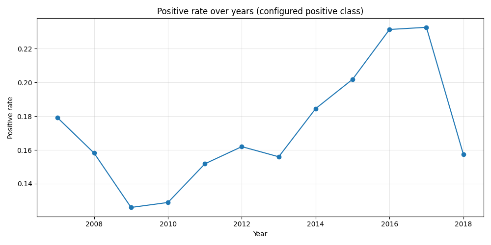{#fig:eda-class-balance}

Missingness and leakage (why shown). [Figure](#fig:eda-missingness) surfaces high‑missing, post‑event operational fields that must be excluded to avoid leakage.

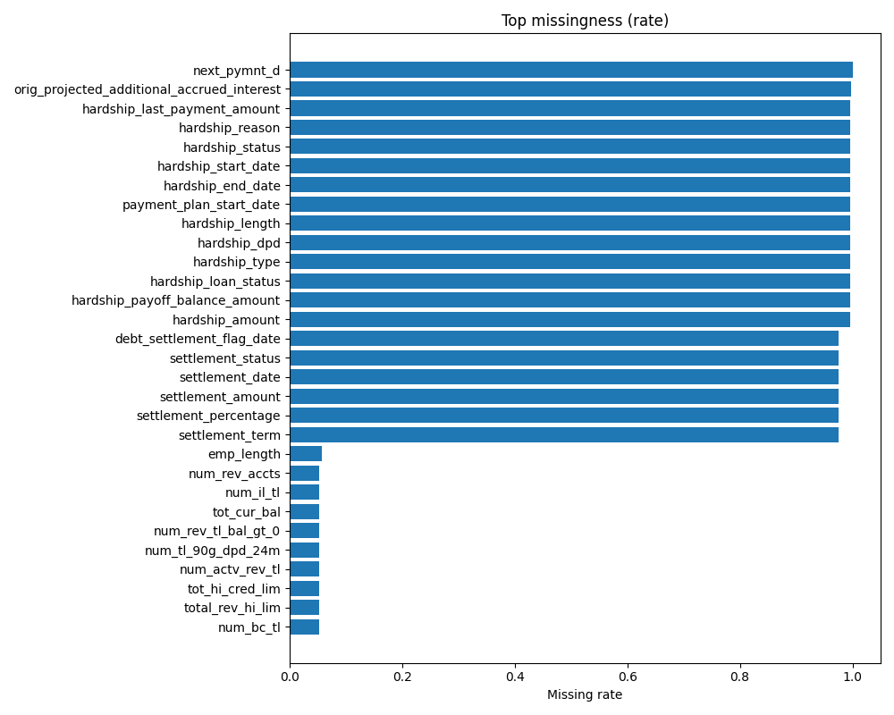{#fig:eda-missingness}

Distributions (why shown). Histograms contextualize ranges, outliers, and monotonic expectations—inputs to winsorization and monotone priors for NNs (see Figures [loan amount](#fig:eda-hist-loan), [interest rate](#fig:eda-hist-int), [FICO average](#fig:eda-hist-fico), and [DTI](#fig:eda-hist-dti)).

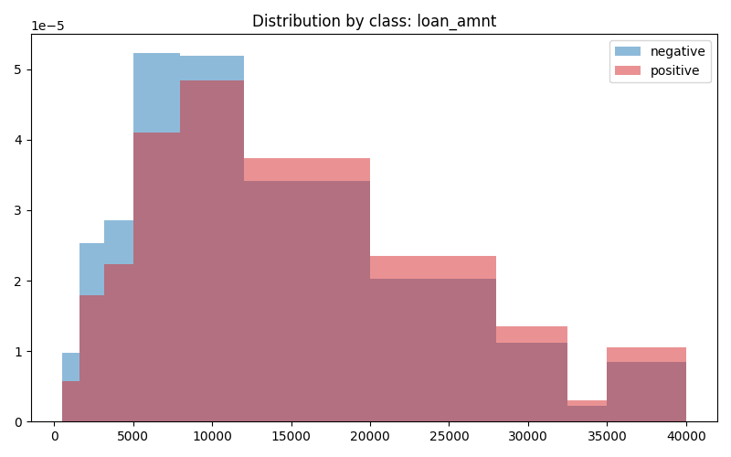{#fig:eda-hist-loan}

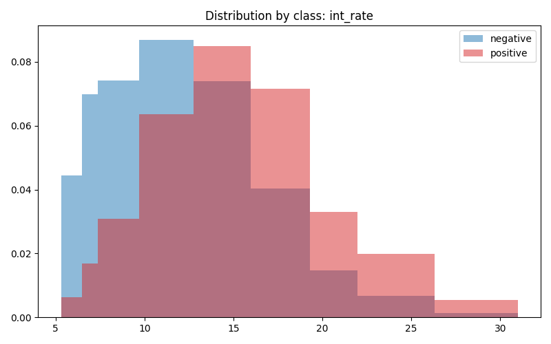{#fig:eda-hist-int}

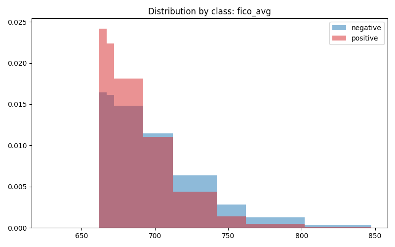{#fig:eda-hist-fico}

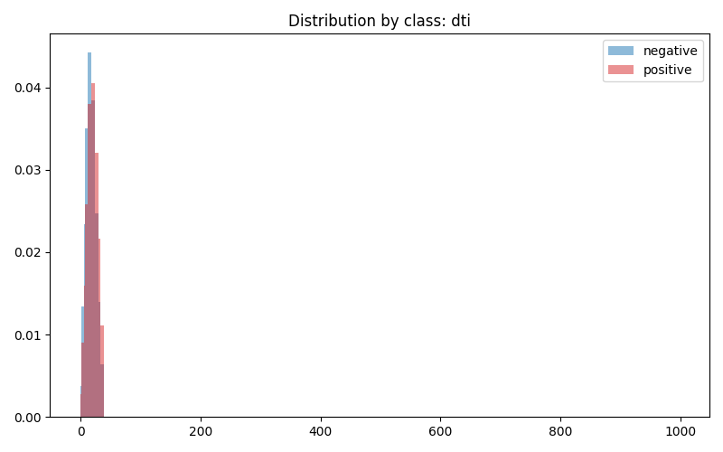{#fig:eda-hist-dti}

Categoricals (why shown). Bar plots reveal ordinal monotonicity (grade/sub_grade), policy signals (term), and context (purpose, home ownership) (see Figures [grade](#fig:eda-cat-grade), [sub‑grade](#fig:eda-cat-subgrade), [term](#fig:eda-cat-term), and [purpose](#fig:eda-cat-purpose)).

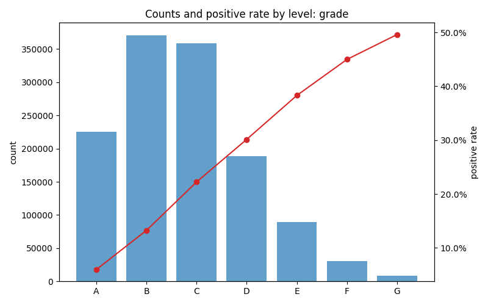{#fig:eda-cat-grade}

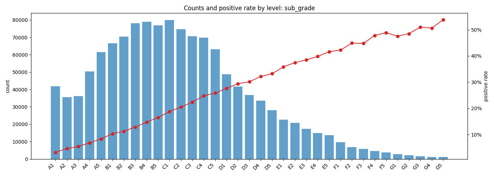{#fig:eda-cat-subgrade}

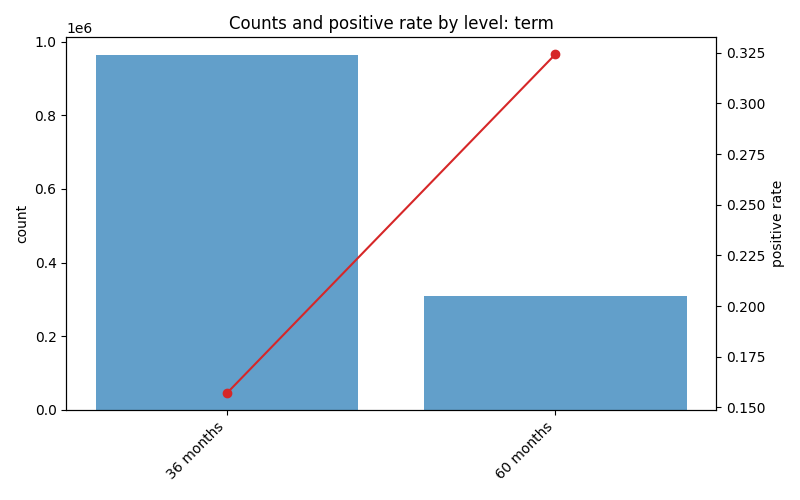{#fig:eda-cat-term}

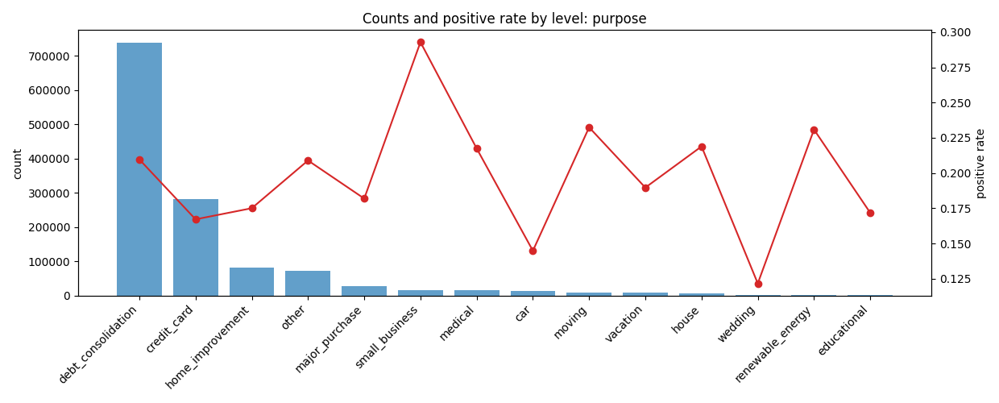{#fig:eda-cat-purpose}

Leakage demonstration and signal strength (why shown). We include two correlation panels and two PSI panels to (i) contrast origination‑only vs leaky features and (ii) quantify temporal drift (see Figures [origination‑only correlations](#fig:eda-corr-orig), [leaky correlations](#fig:eda-corr-leaky), [numeric PSI](#fig:eda-psi-num), and [categorical PSI](#fig:eda-psi-cat)).

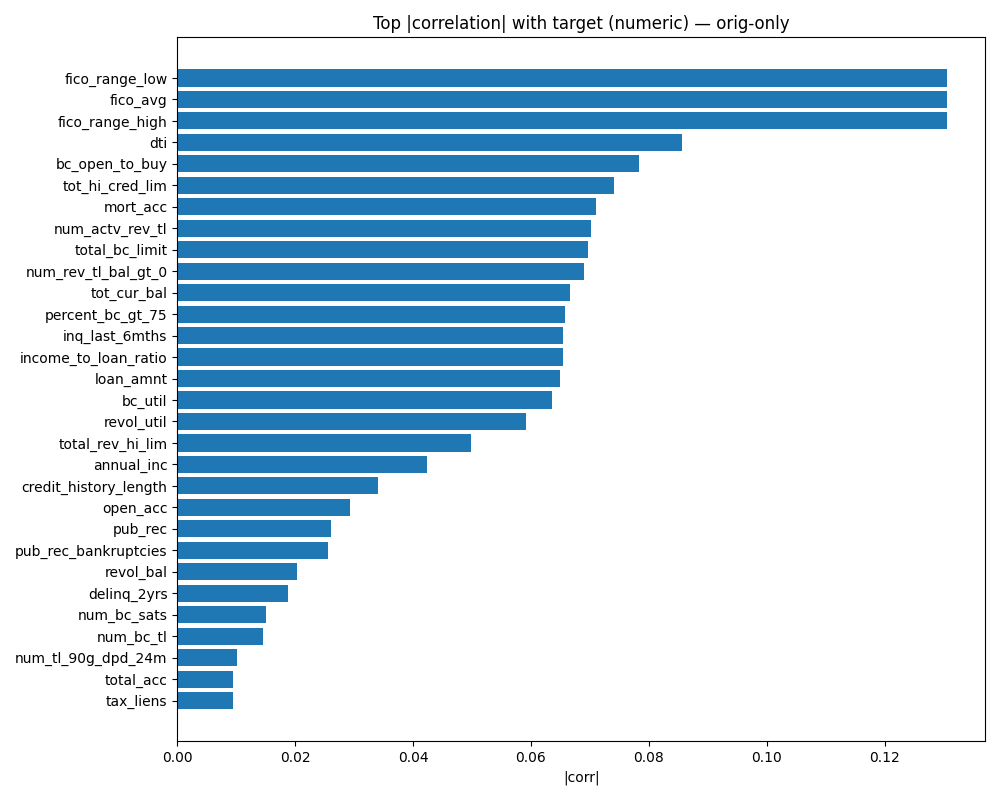{#fig:eda-corr-orig}

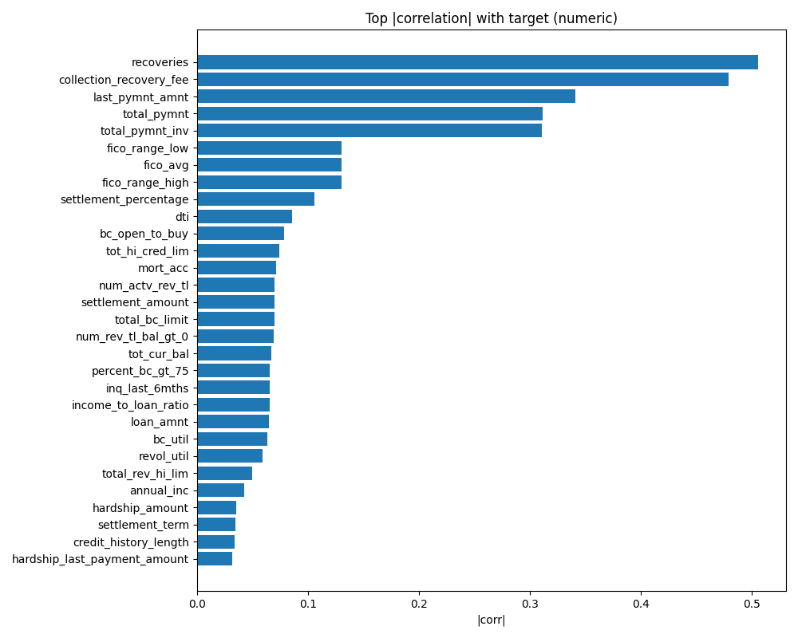{#fig:eda-corr-leaky}

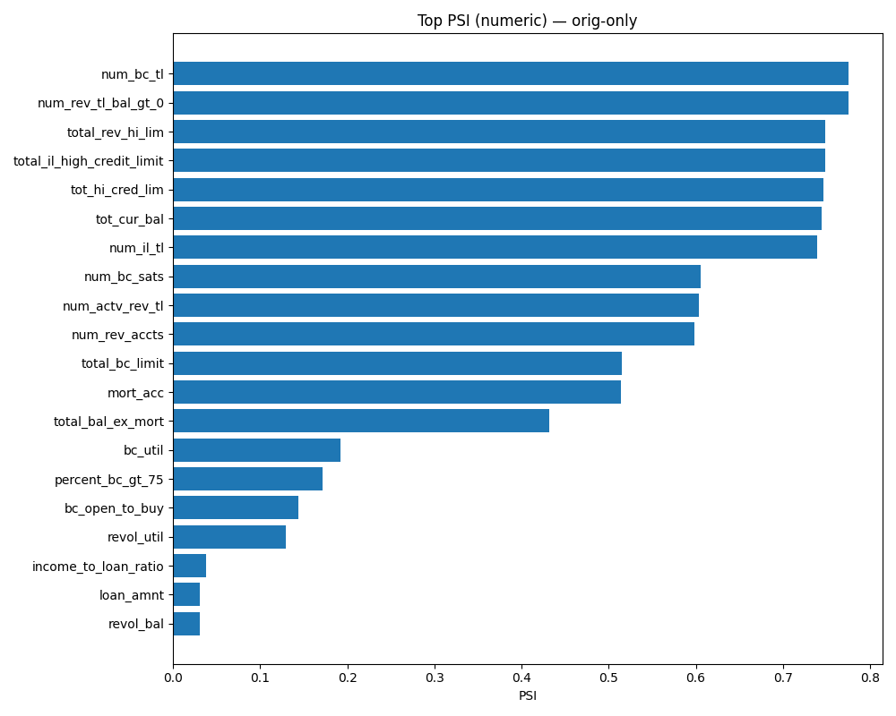{#fig:eda-psi-num}

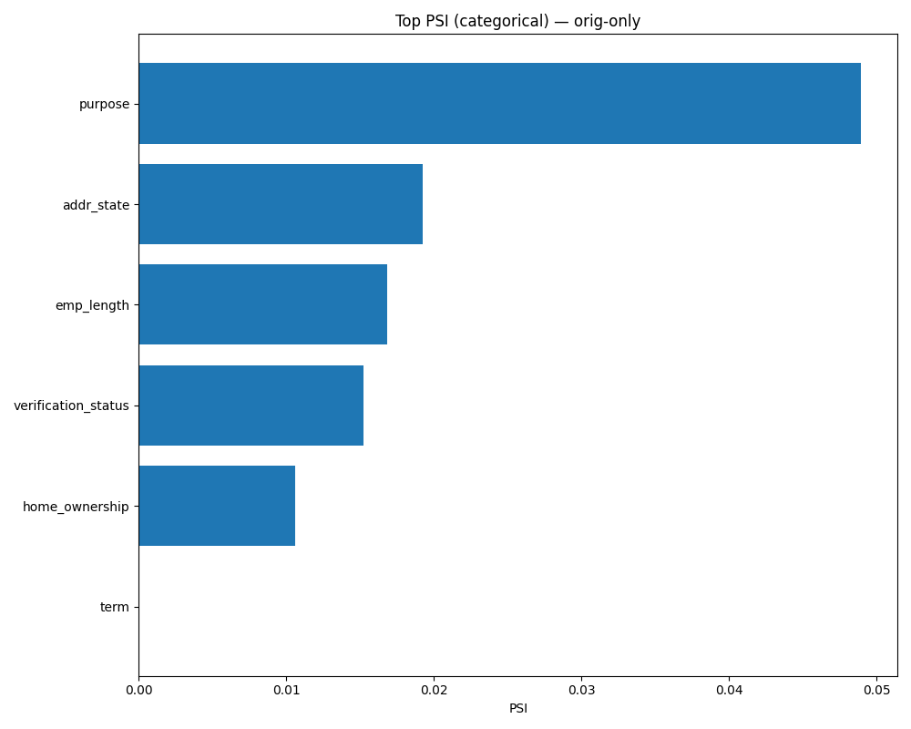{#fig:eda-psi-cat}

How EDA informs modeling. The figures [here](#fig:eda-class-balance)–[here](#fig:eda-psi-cat) collectively justify: (i) time‑based splits and fixed thresholds, (ii) leakage exclusion policies, (iii) winsorization and monotone priors for NNs on `int_rate` and `dti`, (iv) embeddings for ordinal categoricals (grade/sub_grade), and (v) drift monitoring (PSI) with recalibration or retraining.

# 5 Feature Regimes and Dataset Scales

We evaluate four representative feature regimes and three dataset scales:

Feature regimes.
1) Compact baseline (about 12 features): core demographic, capacity, and FICO-range signals.
2) Compact + pricing/grade (about 16 features): adds `int_rate`, `grade`, `sub_grade`, and `installment`.
3) Broad without pricing (about 39 features): adds depth/limits/utilization but excludes pricing/grade.
4) Broad + pricing/grade (about 43 features): combines broad signals and pricing/grade.

Dataset scales.
1) 10k: medium-sample; sufficient to benefit from richer features.
2) 100k: large-sample; strong signal and robust comparisons.
3) full: full cohort; most realistic “production-like” benchmark.

# 6 Modeling Families and Why They Fit This Task

We compare common tabular modeling families and analyze their suitability to the LendingClub task.

Generalized Linear Models (GLM). Logistic regression provides a transparent baseline with calibrated probabilities under certain assumptions. It captures additive effects but struggles with high-order interactions unless engineered.

Random Forests (DRF). Ensembles of de-correlated trees reduce variance and capture non-linearities. They can handle heterogeneous scales and some categorical encodings but may be outperformed by boosted trees on tabular tasks.

Gradient-Boosted Trees (GBM) and XGBoost. Additive trees trained stage-wise excel on structured, tabular problems, capturing interactions with strong regularization and built-in handling of missingness. These models are typically top-performing for tabular credit risk.

Deep Neural Networks (MLP). Fully-connected networks approximate complex functions given sufficient data and regularization. They require careful design for tabular data: robust preprocessing, categorical encodings (embeddings or one-hot), batch normalization, dropout, early stopping, and calibrated outputs. They can model interactions naturally but can lag boosting unless architecture and training are tuned to tabular idiosyncrasies. Recent studies demonstrate hybrid or carefully-regularized NNs achieving competitive performance on credit-like tasks [@li2022evaluation; @wang2024hybrid].

Why NNs matter here. NNs offer a single, end-to-end model that can incorporate learned embeddings for categorical grades [@guo2016entity], side-channel text (e.g., loan descriptions), and additional modalities in future iterations. With calibration and monotonic priors [@platt1999probabilistic; @zadrozny2001obtaining; @guo2017calibration; @chen2016xgboost; @ke2017lightgbm], they can become competitive and more portable across providers.

## 6.1 Feature Selection Procedure

Objective. Reduce variance and drift sensitivity while preserving predictive power, under the same time‑based protocol as training.

Method (baseline). We use filter methods—mutual information (MI) and L1‑regularized logistic regression—as first‑pass selectors:
- Evaluation protocol: time‑based split on `issue_d`; validation carved from the training period only; no lookahead to test; invariants match training (imputation, winsorization, encoding).
- Ranking: MI for non‑linear dependency; L1 for sparse linear signal. We aggregate or compare to stabilize against idiosyncratic ties.
- Stopping rules: cap by target feature count (e.g., 12/16/39/43 regimes) and/or MI elbow; confirm AUC/PR vs full set on validation.
- Outputs: selected feature list, full ranking, and AUC/PR curves; these drive the compact regimes used in the experiments.

Engineering toggles. Engineered features (e.g., `fico_avg`, `fico_spread`, `income_to_loan_ratio`) can be included/excluded explicitly to quantify their lift. Selection runs mirror training preprocessing so that downstream metrics remain comparable.

## 6.2 Feature Regimes: Provider‑Agnostic vs Provider‑Aware

Provider‑agnostic (portable) regime. Excludes provider pricing/scoring features (e.g., `int_rate`, `grade`, `sub_grade`, `installment`). Rationale: portability across lenders/policies and reduced drift risk. EDA shows these fields are predictive but can encode policy and macro effects; omitting them improves generalization when policy changes.

Provider‑aware (in‑provider accuracy) regime. Includes pricing/grade; improves AUCPR/ROC at 10k/100k/full by leveraging monotone and ordinal signals. Rationale: if deployment is tied to the same provider, these features capture underwriting decisions that correlate with risk. We monitor drift (PSI) and use calibration/threshold selection to maintain decision quality.

Trade‑offs. Accuracy vs portability; monotonicity vs policy sensitivity; fairness considerations (avoid granular geography like ZIP). Our results show where each regime wins, and the NN roadmap targets closing the gap in the agnostic setting via representations and monotone priors.

## 6.3 Primer on Algorithm Families

Logistic Regression (GLM). A generalized linear model mapping a linear combination of inputs through a logistic link to produce probabilities. Pros: simplicity, interpretability, and fast training. Cons: limited to additive effects unless interactions are manually engineered; can underfit complex tabular structure.

Decision Trees. Recursive partitioning of feature space into regions with homogeneous labels. Pros: intuitive splits and basic nonlinearity. Cons: high variance; shallow trees underfit; deep trees overfit; sensitive to small data perturbations.

Random Forests (Bagging). An ensemble of trees trained on bootstrap samples with feature subsampling at splits. Pros: variance reduction; robust to noise; handles mixed feature types. Cons: weaker at capturing subtle additive improvements than boosting; may lag in AUCPR versus tuned boosting.

Gradient-Boosted Trees (GBM/XGBoost). Iteratively add trees to correct residuals from prior trees. Pros: strong performance on structured tabular data; captures interactions; built-in regularization (shrinkage, subsampling, depth constraints). Cons: tuning required (learning rate, depth, min child weight, subsampling); feature monotonicity not guaranteed unless explicitly constrained.

Neural Networks (MLP for Tabular). A stack of linear layers with nonlinear activations (e.g., ReLU/GELU), optionally batch normalization and dropout, trained with stochastic gradient descent variants (Adam, AdamW). Pros: flexible function approximators; easy to incorporate learned embeddings and auxiliary modalities. Cons: sensitive to preprocessing, initialization, and regularization; may be outperformed by boosting without careful design; probability calibration often requires post-hoc methods.

Losses and Imbalance. Binary cross-entropy (BCE) is standard for probabilistic classification; focal loss reweights hard examples to improve minority-class recall at the cost of calibration. Class weights or balanced batches mitigate skew. Evaluation should prioritize PR curves (precision/recall) and AUCPR rather than accuracy.

Calibration. For threshold-dependent decisions (e.g., approve/decline), well-calibrated probabilities matter. Platt scaling (logistic regression on logits), isotonic regression (non-parametric), or temperature scaling (for NNs) align predicted probabilities to empirical frequencies on validation.

# 7 Experimental Setup

Data handling and leakage control. We exclude post-origination features (payments, recoveries, last_* dates, hardship/settlement) from all runs. This aligns with best practices and prior empirical audits on LendingClub.

Preprocessing. Numerical features use median imputation and standardization; categorical features use frequent-category imputation with one-hot encoding. Winsorization limits outliers for sensitive ratios (`dti`, `revol_util`, `income_to_loan_ratio`, etc.). Engineered features include `fico_avg`, `fico_spread`, and `income_to_loan_ratio` when enabled.

Evaluation. We adhere to chronological train/test splits; select thresholds on validation (Youden J) within the training period; and report test metrics at the fixed threshold. We compute AUCPR and ROC AUC, plus confusion, precision, recall, and FPR at the operating point. Prior credit risk work emphasizes time-aware modeling and censoring considerations that motivate temporal evaluation in our setting [@Banasik1999; @Bellotti2013].

Automated modeling backend. H2O AutoML orchestrates GBM, XGBoost, DRF, GLM, and Deep Learning (MLP) models, producing leaderboards and explainability artifacts (variable importance, partial dependence, SHAP-like insights). We use these for transparent comparisons and to guide NN engineering in future iterations. Neural-network-centric PyTorch runs are planned and discussed in Section 15 (Future Work).

Reproducibility (high level, within this thesis). All comparisons share: the same dataset cohorts, origination-only features, chronological splits, validation-carved threshold selection, and consistent preprocessing. Each figure and table in this thesis references artifacts produced under these constraints, ensuring repeatability.

## 7.1 H2O AutoML (How We Use It)

We leverage H2O as an industrial-strength modeling platform to establish strong baselines, standardized comparisons, and rich explainability. This section summarizes the parts most relevant to our thesis and how they blend into the methodology.

- Estimator catalog. H2O ships first-class implementations across families—GBM, XGBoost, DRF/XRT (tree ensembles), GLM (linear), and Deep Learning (feed-forward NNs)—plus specialized algorithms (survival/CoxPH, isolation forests, RuleFit, target encoding). AutoML orchestrates these under shared pre-processing and scoring policies. This breadth lets us compare NNs to state-of-the-art tree baselines under one roof.
- AutoML controls. Budgets can be expressed in time or model counts; leaderboard sorting can be set to AUCPR (our primary metric under class imbalance). Reproducibility is promoted via seeds, include/exclude algorithm lists, and CV artifact retention. In this thesis, we set leaderboard sorting to AUCPR and use a time budget that scales with dataset size.
- Explainability & comparison. H2O provides leaderboards, ROC/PR curves, per-family and per-model variable importance, permutation varimp, partial dependence/ICE, and SHAP-like row explanations. In this thesis, we use leaderboards for AUCPR/ROC comparisons, per-family varimp heatmaps to interpret drivers, and model-correlation/Pareto analyses to reason about diversity and trade-offs.
<!-- Deployment artifacts detail removed to keep thesis self-contained -->

Why H2O here. Using a single platform to produce multi-family baselines, curated leaderboards, and aligned explainability reduces variance in our comparisons and keeps the focus on scientific questions—e.g., when NNs compete, which features help them most, and how stable the conclusions are across time splits. The figures and tables throughout the Results sections are generated from H2O outputs so that every claim is grounded in consistent, reproducible artifacts.

### Why We Chose H2O (Decision Rationale)

We chose H2O as the comparative backend for four primary reasons that align with the thesis goals:

1) Apples‑to‑apples multi‑family baselines under one roof. H2O trains GBM, XGBoost, DRF, GLM, and DeepLearning with consistent pre‑processing, scoring, and logging. This eliminates hidden confounders when comparing NNs to ensembles and keeps our focus on the scientific question (feature regimes and NN viability), not on tool mismatches. We sort the leaderboard by AUCPR to match our imbalance‑aware objective.

2) Rich, standardized explainability. Built‑in per‑family varimp heatmaps, partial dependence/ICE, and model‑correlation/Pareto plots allow us to interpret drivers and diagnose model diversity without bespoke code. This is crucial to a neural‑centric thesis: we can contrast NN attributions against GBM/XGB drivers to understand when and why NNs differ.

3) Reproducible artifacts and scalable search. Time‑budgeted AutoML scales to larger datasets (100k, full) while keeping seeds and knobs (nthreads, include/exclude lists) reproducible.

4) Complements a PyTorch NN track. H2O’s DeepLearning provides a strong, well‑regularized MLP baseline for tabular data; ensembles (GBM/XGB) serve as a robust yardstick. This frees the PyTorch track to focus on NN‑specific improvements (embeddings, monotone regularization, calibration, temporal CV) while we retain consistent, state‑of‑the‑art tree baselines for comparison.

Limitations (acknowledged). H2O’s DeepLearning is not a replacement for modern tabular NN research (e.g., transformers with feature tokenization). We therefore treat it as a strong MLP baseline, and we outline a PyTorch plan (Section 15, Future Work) for neural‑first advances. H2O also requires Java; we mitigate this operational constraint with a documented pre‑flight and containerized environments.

### DeepLearning (NN) Modeling Plan in H2O AutoML

What H2O trains (exact regime). In H2O AutoML 3.46.x, the DeepLearning (feed‑forward NN) component consists of one small default model and three predefined hyperparameter grids. These are implemented in the AutoML Java sources (DeepLearningStepsProvider) and surface in leaderboards with IDs such as `DeepLearning_def_1_AutoML_...` and `DeepLearning_grid_{1,2,3}_AutoML_...` (we observe these in our run artifacts, e.g., `docs/experiments/run/h2o_full_dataset/results/h2o_leaderboard.csv`).

- Default model (`def_1`). Hidden layers: `[10, 10, 10]`. Other parameters use H2O defaults (Rectifier activation; no dropout grid). Purpose: lightweight baseline NN.
- Grid steps (`grid_1`, `grid_2`, `grid_3`). Common base settings across all grids:
  - Activation: `RectifierWithDropout`
  - Adaptive rate: `true` (AdaDelta‑style) with search over `_rho ∈ {0.9, 0.95, 0.99}` and `_epsilon ∈ {1e‑6, 1e‑7, 1e‑8, 1e‑9}`
  - Input dropout ratio search: `_input_dropout_ratio ∈ {0.0, 0.05, 0.10, 0.15, 0.20}`
  - Epochs: `_epochs = 10000` (effective training governed by early stopping on the AutoML‑configured metric)
  - Hidden‑layer dropout ratios: uniform per layer, grid‑searched as below
  - Early stopping and validation usage follow the AutoML run settings (our configs set `stopping_metric: AUC`, `sort_metric: AUCPR`, and provide a validation frame carved from train time).
  - Architectural grids:
    - `grid_1` (1 layer): `_hidden ∈ { [20], [50], [100] }`; `_hidden_dropout_ratios ∈ { [0.0], [0.1], [0.2], [0.3], [0.4], [0.5] }`
    - `grid_2` (2 layers): `_hidden ∈ { [20,20], [50,50], [100,100] }`; `_hidden_dropout_ratios ∈ { [0.0,0.0], [0.1,0.1], …, [0.5,0.5] }`
    - `grid_3` (3 layers): `_hidden ∈ { [20,20,20], [50,50,50], [100,100,100] }`; `_hidden_dropout_ratios ∈ { [0.0,0.0,0.0], [0.1,0.1,0.1], …, [0.5,0.5,0.5] }`

Provenance (source and version). These grids are defined in H2O AutoML’s Java code for release 3.46 (the version we pin in `requirements.txt`): `h2o-automl/src/main/java/ai/h2o/automl/modeling/DeepLearningStepsProvider.java`. The code sets the base parameters and search spaces quoted above (activation, adaptive rate with rho/epsilon, input/hidden dropout grids, and hidden layer sizes). Our leaderboards show entries like `DeepLearning_grid_2_AutoML_...`, which correspond exactly to these steps. See also the H2O AutoML and Deep Learning manuals for defaults and behavior [@h2o2018automl; @h2o2018deeplearning].

Implications for this thesis. H2O’s DL search explores shallow‑to‑moderate MLPs (1–3 layers) with modest widths (20/50/100) and systematic dropout/optimizer hyperparameters. It does not include embeddings, batch normalization, GELU/modern activations, or deeper/wider stacks. Consequently, we treat it as a strong, regularized baseline NN for tabular data and build our PyTorch roadmap (Section 15) to extend beyond this regime (categorical embeddings, monotone regularization, calibration, and deeper architectures when justified by data scale).

## 7.2 AutoML Settings (This Thesis)

::: {#tbl:automl-settings}
| Dataset | Max runtime | Sort metric | Seed | Families (eligible) | Threshold selection |
|---|---:|---|---:|---|---|
| 10k | ~300 s | AUCPR | 42 | GBM, XGB, DRF, GLM, DeepLearning | Youden J on validation |
| 100k | ~900 s | AUCPR | 42 | GBM, XGB, DRF, GLM, DeepLearning | Youden J on validation |
| full | ~5,400 s | AUCPR | 42 | GBM, XGB, DRF, GLM, DeepLearning | Youden J on validation |

: AutoML settings per dataset (budgets, sorting, thresholding)
:::

Notes. Budgets scale with dataset size (cf. suite run scripts); leaderboard sorting is AUCPR to reflect class imbalance; thresholds are always chosen on validation and fixed for test.

# 8 Results: Winners and Cross-Dataset Comparison

Table 1 summarizes the winning configuration (by AUCPR) per dataset size, along with ROC AUC. See per‑dataset figures in Section 9.

::: {#tbl:winners}
| Dataset | Winner Family | Feature Regime | Avg Precision | ROC AUC |
|---|---|---|---:|---:|
| 10k  | GBM               | Broad+Pricing/Grade (43)     | 0.4601 | 0.7591 |
| 100k | XGBoost           | Broad+Pricing/Grade (43)     | 0.4524 | 0.7435 |
| full | GBM               | Broad+Pricing/Grade (43)     | 0.3934 | 0.7093 |

: Winners by dataset size (best AUCPR per size) — model family and feature regime
:::

See this [table](#tbl:winners) for a compact overview; detailed curves and model explainability are analyzed next. We emphasize PR (precision–recall) as the primary metric due to class imbalance [@saito2015precision; @davis2006relationship]: it directly reflects precision at relevant recall levels for default detection. ROC AUC complements PR by showing overall ranking quality irrespective of threshold.

Observations.
- 10k/100k/full: The broad + pricing/grade (43 features) wins by a clear AUCPR margin. Pricing (`int_rate`) and grade information are consistently top drivers, improving ranking quality and precision at relevant recall levels.

## 8.1 Ablation: Pricing/Grade Inclusion

Including provider‑aware features (`int_rate`, `grade/sub_grade`, `installment`) improves AUCPR consistently across scales:
- 10k: +0.0395 vs compact (0.4601 vs 0.4206).
- 100k: +0.0255 vs compact (0.4524 vs 0.4269).
- full: +0.0278 vs compact (0.3934 vs 0.3656).

These gains support H1 (Section 1.4) and justify provider‑aware regimes when portability permits. Thresholded metrics at the fixed validation‑chosen threshold also improve precision at comparable recall (see per‑dataset sections).

# 9 Per-Dataset Analyses with Inline Figures

We now analyze each dataset size (10k, 100k, full), include curves and explainability figures, and interpret takeaways.

## 9.1 10k subset (medium-sample regime)

Winner and rationale. The winner uses 43 features (broad + pricing/grade). Average Precision is 0.4601; ROC AUC is 0.7591. At this scale, enriched pricing/grade features tend to lift PR in the high-recall region where false positives are costly.

{#fig:10k-pr}

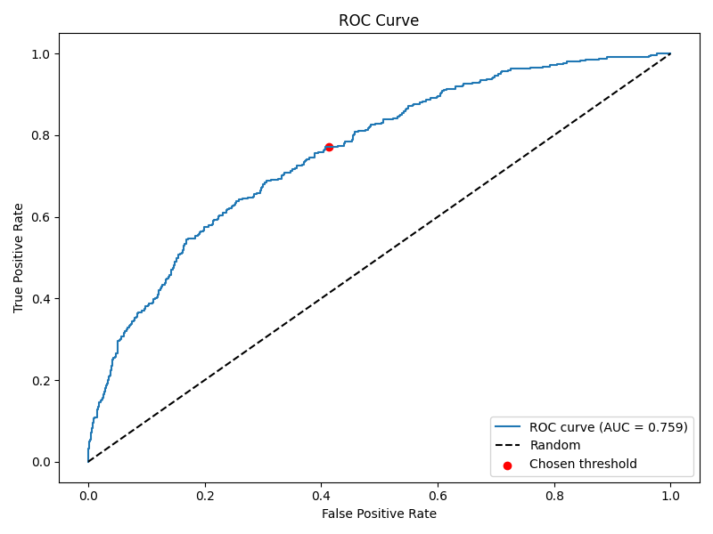{#fig:10k-roc}

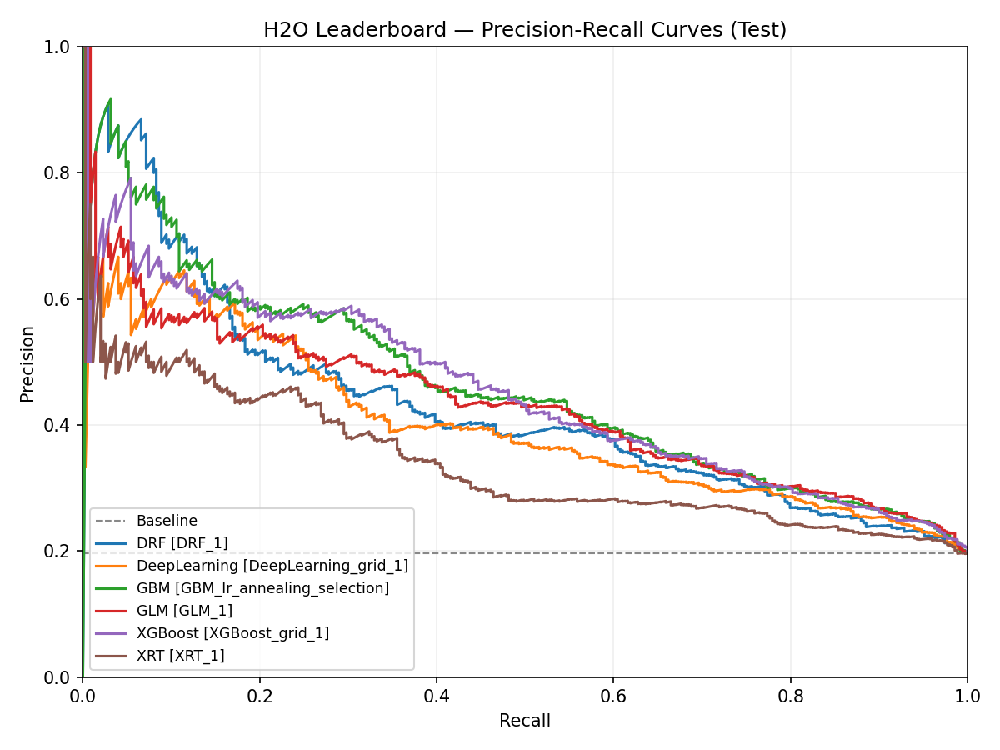{#fig:10k-lbpr}

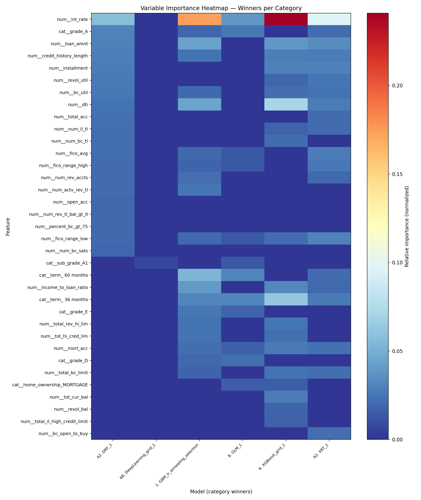{#fig:10k-varimp}

Method. GBM/XGB importance reflects cumulative gain across splits; NN importance is sensitivity‑based. Values are normalized per model and stacked for comparison (see Appendix A/C for exact tables).

Curves (why shown). At 10k, enrichment improves both threshold‑sensitive performance (PR) and threshold‑free ranking (ROC), suggesting a genuine gain rather than a threshold artifact (see Figures \ref{fig:10k-pr} and \ref{fig:10k-roc}).

Model comparison (why shown). Comparing PR across the top models makes the magnitude of improvement tangible (see Figure \ref{fig:10k-lbpr}); this is preferred over single‑number summaries because AUCPR integrates across all operating points.

Explainability (why shown). `int_rate`, term, and grade carry much of the discriminative power at 10k—evidence to include these features at this scale while monitoring drift (see Figure \ref{fig:10k-varimp}).

Interpretation and NN contrast. Adding pricing/grade yields a noticeable AUCPR lift relative to 12- or 39-feature baselines. `int_rate` emerges as a dominant driver, with term and grade bands providing additional stratification. Ensembles lead overall; NNs benefit from richer signals but remain slightly behind top GBM/XGBoost here. NN varimp (deeplearning) highlights `fico_spread`, term, and select purpose/state dummies—overlapping with GBM drivers but often spreading attribution across categorical partitions rather than ranking `int_rate` as sharply as GBM. This suggests NNs can leverage generalizable capacity/depth cues but may require explicit encoding/regularization to fully exploit pricing/grade at this scale.

## 9.2 100k subset (large-sample regime)

Winner and rationale. The winner uses 43 features (broad + pricing/grade). Average Precision is 0.4524; ROC AUC is 0.7435. With more data, the model can exploit richer interactions embedded in pricing/grade without overfitting.

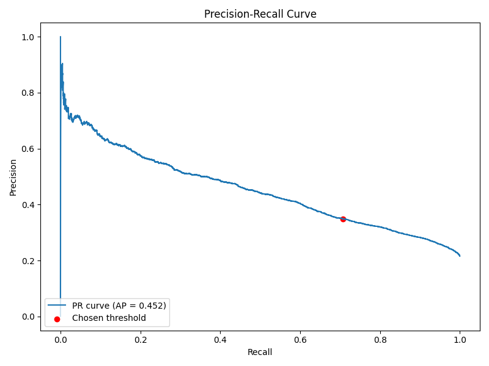{#fig:100k-pr}

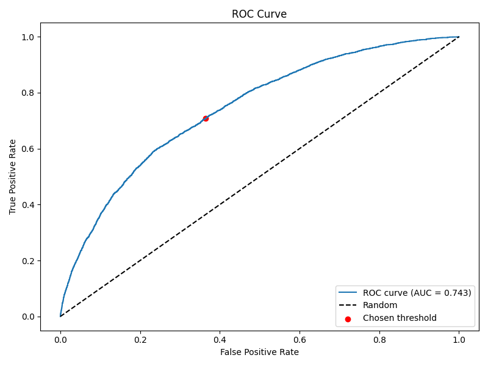{#fig:100k-roc}

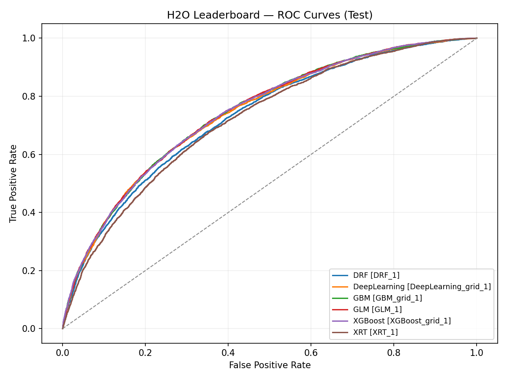{#fig:100k-lbroc}

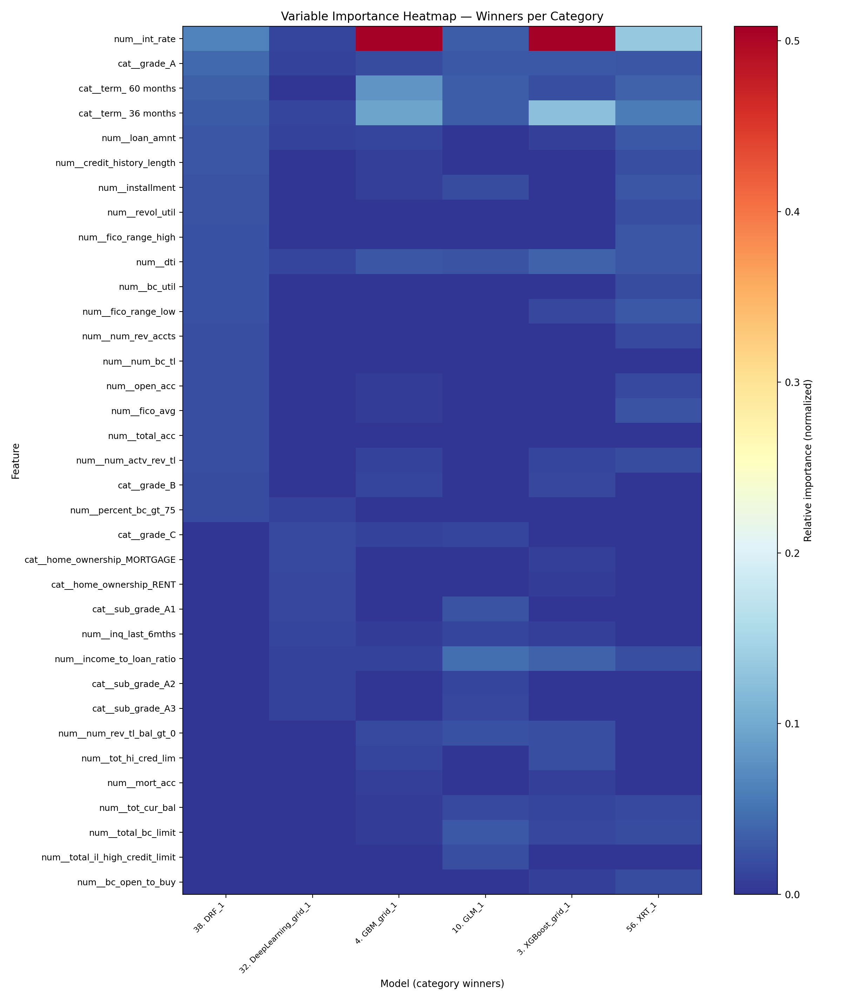{#fig:100k-varimp}
Method. Importance is normalized per model; compare ranks across winners for robustness.

Curves (why shown). At 100k, enrichment sustains PR gains while maintaining high ROC AUC, indicating robustness rather than a narrow operating‑point win (see Figures \ref{fig:100k-pr} and \ref{fig:100k-roc}).

Model comparison (why shown). ROC comparisons highlight where ensembles outperform alternatives (see Figure \ref{fig:100k-lbroc}), which is appropriate for ranking‑focused screening.

Explainability (why shown). Pricing/grade dominate at scale, with `dti` and credit depth contributing incremental lift (see Figure [VarImp heatmap](#fig:100k-varimp)).

Interpretation and NN contrast. With more data, pricing and grading fully dominate variable importance, with `dti`, credit depth, and loan size adding incremental signal. Tree ensembles (GBM/XGBoost) capitalize on these structured interactions and achieve top performance. NN varimp at 100k ranks grade/term, `int_rate`, and `fico_spread` among top drivers, but the attribution remains more distributed across sub-grades and home-ownership states compared to GBM’s sharper focus on `int_rate` and term. This is consistent with NNs learning broader categorical embeddings that capture latent structure.

## 9.3 Full dataset (production-like benchmark)

Winner and rationale. The winner uses 43 features (broad + pricing/grade). Average Precision is 0.3934; ROC AUC is 0.7093. Threshold (Youden J, selected on validation): 0.1765. Confusion (test): tp=36,227; tn=129,969; fp=68,284; fn=19,876 (Precision 0.347; Recall 0.646; FPR 0.344). We report PR and ROC because they serve complementary roles: PR guides action under imbalance; ROC validates stable ranking.

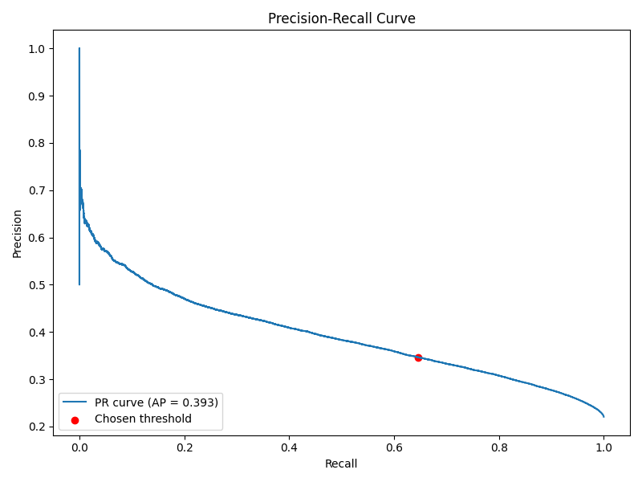{#fig:full-pr}

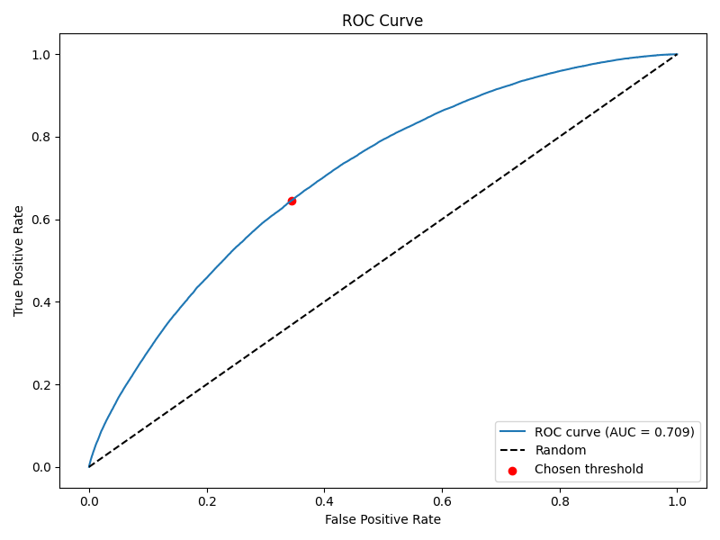{#fig:full-roc}

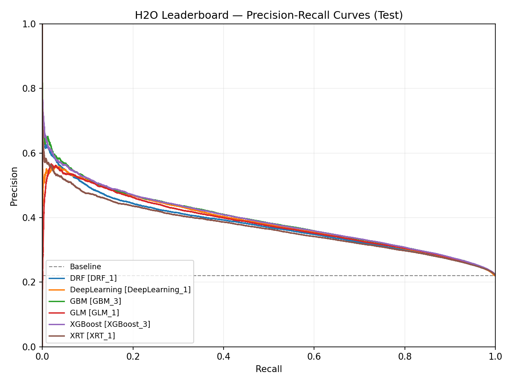{#fig:full-lbpr}

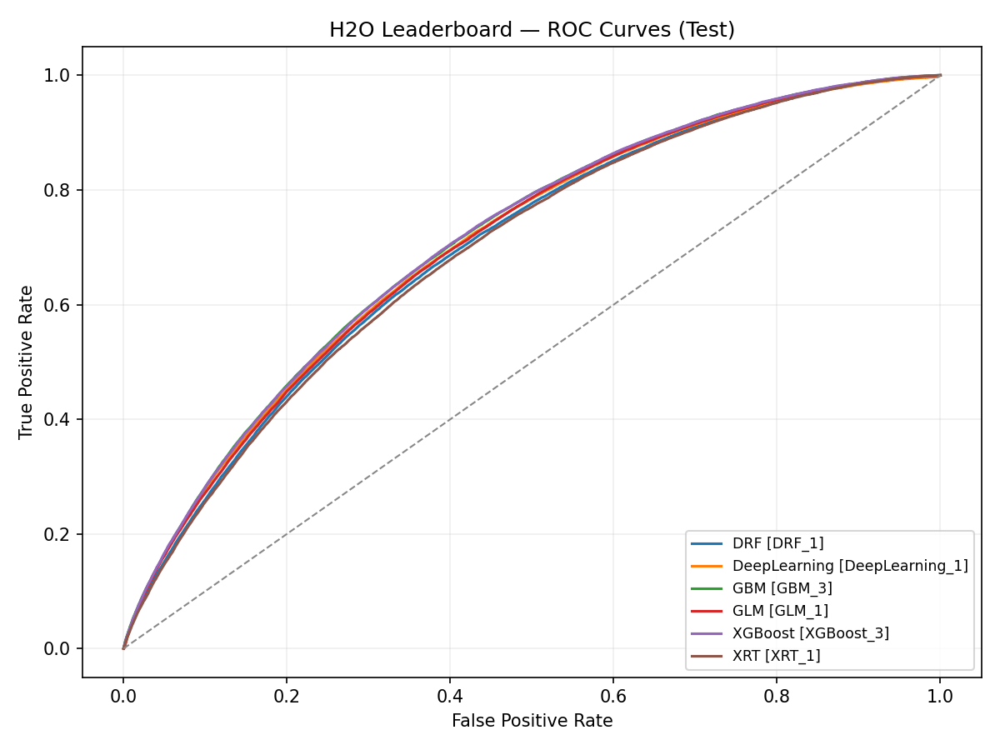{#fig:full-lbroc}

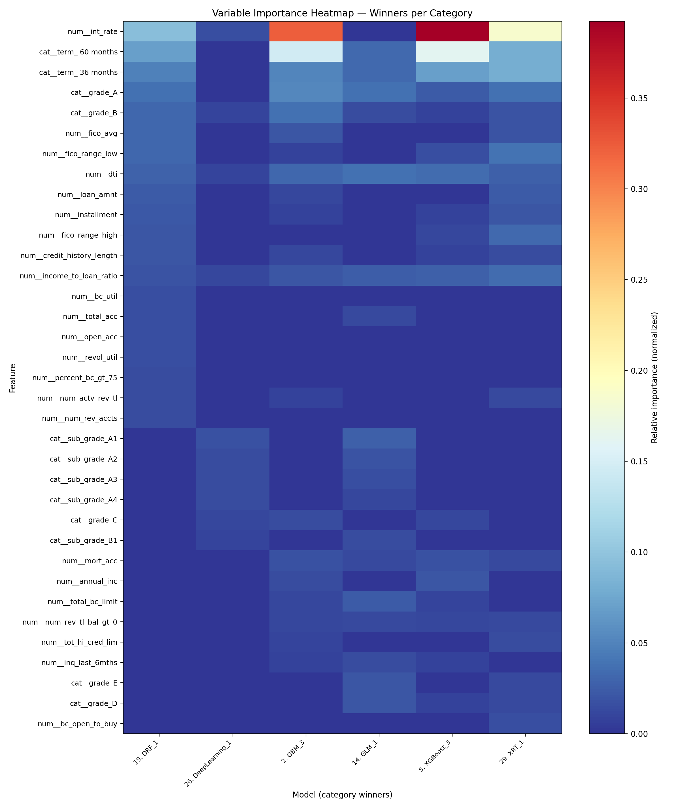{#fig:full-varimp}
Method. Importance summarizes contribution within each family; see Appendix A/C for top‑10 tables.

Curves (why shown). On the full dataset, both PR and ROC document performance and anchor the fixed threshold to the PR shape (see Figures \ref{fig:full-pr} and \ref{fig:full-roc}).

Model comparison (why shown). Comparing the strongest contenders in both PR and ROC spaces ensures the chosen winner is not an artifact of a single metric (see Figures \ref{fig:full-lbpr} and \ref{fig:full-lbroc}).

Explainability (why shown). Pricing (`int_rate`), term, and grade dominate feature importance—evidence for including these variables in production‑scale models (see Figure [VarImp heatmap](#fig:full-varimp)).

NN attributions vs GBM (full). For the full dataset, NN varimp (deeplearning) elevates `int_rate` and a hierarchy of sub-grades (A1–A4) alongside `addr_state_CA` and `purpose_debt_consolidation`, while GBM varimp emphasizes `int_rate`, term (36/60), grade bands, and DTI. The overlap on `int_rate` and grade is substantial, but the NN’s finer-grained focus on sub-grade categories suggests that learned embeddings capture within-grade nuances. GBM’s stronger ranking of term is consistent with tree splits exploiting the 36/60 dichotomy efficiently. This contrast supports using embeddings and monotonic cues in NNs so they can match the crispness of tree splits on known monotone drivers.

Diversity and trade-offs (why shown). We assess model diversity and the AUCPR–ROC trade-off frontier to reason about stacking/ensembling potential and to select models that are Pareto-efficient rather than single-metric winners.

Family summaries (why shown). We summarize performance by family and highlight the best per family—useful to understand whether NNs lag uniformly or only against certain ensembles.

Interpretation. The enriched regime maintains the best AUCPR; pricing (`int_rate`) and term/grade signals dominate. This aligns with lender risk and pricing policy at origination: cost of credit correlates with default risk. Importantly, `installment` adds little beyond `loan_amnt`, `term`, and `int_rate`—consistent with deterministic relationships. These insights will guide architecture and feature choices for NNs.

# 10 Why Ensembles Lead and How NNs Can Catch Up

9.1 Strengths of Gradient Boosting on Tabular Data

Boosted trees thrive on structured, heterogeneous tabular features: they naturally capture non-linearities and interactions without heavy feature engineering, handle missingness, and regularize effectively. Their built-in split search over ordinal encodings of categoricals (e.g., one-hot grade levels) yields powerful, piecewise-constant approximations that often set a strong bar.

9.2 Challenges and Opportunities for NNs on LendingClub

Neural networks must convert heterogeneously-scaled, partially ordinal, and often sparse inputs into representations that make learning efficient and stable. Critical factors:

Categorical encodings. One-hot encoding for high-cardinality categories (e.g., `sub_grade`) can inflate dimensionality. Learned embeddings compress categories into dense vectors that capture similarity, improving sample efficiency. Embeddings for `grade`/`sub_grade`, `addr_state`, and `purpose` are natural targets.

Monotonic and domain priors. Many tabular relationships are monotonic (e.g., higher `int_rate` implies higher default risk, all else equal). Injecting monotonic constraints or regularizing partial derivatives along key features stabilizes learning, reduces overfitting, and improves interpretability.

Regularization and optimization. BatchNormalization, dropout schedules, weight decay, and careful learning-rate schedules (with early stopping on validation) are essential. Mixup/cutmix for tabular data and sharpness-aware minimization (SAM) are promising.

Class imbalance. Positive class is Charged Off; imbalance requires calibrated loss functions or sampling strategies. Focal loss, class weighting, and balanced batches should be evaluated. Oversampling must remain within the training subset only.

Calibration and thresholds. NNs require post-hoc calibration (Platt, Isotonic, temperature scaling) to align probabilities for thresholding. This is crucial for business decisions derived from precision–recall operating points.

Temporal robustness. Forward-chaining (expanding-window) CV quantifies variance across vintages; NNs benefit significantly from validation regimes that reflect deployment and from drift-aware retraining policies.

# 11 Dataset Size Effects and Temporal Drift

Observation. In several families, 10k outperforms 100k, and both can outperform the full dataset on AUCPR. This is counterintuitive given that more data typically helps.

Hypothesis. Temporal distribution shift dominates the signal as we add older vintages: borrower mix, underwriting policy (pricing/grade), and macro conditions change. The larger datasets include earlier periods whose relationships differ from the later test window, degrading out-of-time precision at the fixed validation-chosen threshold. Smaller samples (10k) drawn closer in time to the test window capture more current relationships and prevalence, yielding better AUCPR despite less data.

Contributing factors.
- Concept drift: changes in `int_rate`, grade policy, or eligibility criteria alter target relationships across vintages.
- Prevalence shift: default base rate varies over time; fixed-threshold decisions can be misaligned when prevalence differs.
- Covariate shift: distributions of capacity/depth features (e.g., DTI, limits) shift, harming ranking near the operating region.
- Label maturity/right-censoring: earlier cohorts have fully matured labels; later cohorts can be partially censored; mixing the two affects learned patterns.

Mitigations (actionable).
- Temporal CV with expanding windows: report means/variances across folds; select hyperparameters that are stable across time.
- Recency weighting: up-weight recent vintages in the loss, or restrict the training window to recent periods when deployment requires it.
- Drift-aware calibration and thresholds: calibrate on the validation slice adjacent to the test window; freeze and periodically re‑calibrate.
- Prior/target shift correction: adjust decision thresholds for changing base rates; consider expected-utility thresholds instead of Youden J.
- Feature stability selection: prefer features stable across folds (PSI/selection frequency) to reduce drift sensitivity.
- Add time-aware signals: include coarse time indicators (e.g., vintage bins) or hierarchical time encodings for NNs; constrain monotone features explicitly (e.g., `int_rate`).

Takeaway. Better AUCPR at 10k vs 100k/full is a strong indicator that drift dominates sample-size gains. Combining temporal CV, recency weighting, and drift-aware calibration can recover the benefits of more data without sacrificing out-of-time precision.

# 12 Extended Analysis: Empirical Signals and Data Drift

Correlation and MI at origination. Correlations show FICO averages as strong anti‑correlates (~−0.13), with DTI and utilization positively associated. Mutual information highlights `fico_spread`, `term`, `fico_avg`, `income_to_loan_ratio`, `loan_amnt`, and inquiry/depth features as high‑signal drivers. These patterns are visible in the origination‑only correlation panel (Figure \ref{fig:eda-corr-orig}).

Leakage demonstration. Including post‑event features (e.g., `total_pymnt`, `recoveries`, `last_pymnt_d`) yields spuriously high correlations and mutual information with the target. This inflates apparent performance and breaks causal ordering; therefore, such fields are strictly excluded. Compare the leaky correlation panel (Figure \ref{fig:eda-corr-leaky}) against the origination‑only counterpart (Figure \ref{fig:eda-corr-orig}).

Temporal drift (PSI). Credit‑depth and limit features shift across vintages, and categorical composition (e.g., `purpose`) drifts modestly. Pricing‑related variables require careful monitoring and, if used, periodic recalibration. See the numeric PSI snapshot (Figure \ref{fig:eda-psi-num}) and categorical PSI snapshot (Figure \ref{fig:eda-psi-cat}).

Implications. Adopt time‑based validation with a fixed, validation‑chosen threshold and schedule periodic retraining. Monitor PSI on top drivers and recalibrate probabilities and thresholds as distributions shift to preserve decision quality.

# 13 Limitations and Threats to Validity

Right-censoring. Recent vintages may be partially observed; chronological splits mitigate but do not eliminate censoring artifacts. Survival/competing-risks modeling is future work.

External generalization. Provider-aware features (pricing/grade) boost accuracy but can reduce portability across lenders or policy regimes. Provider-agnostic models trade a small amount of accuracy for robustness out of domain.

Data quality and measurement error. Stated income and several categoricals contain noise; robust preprocessing and winsorization reduce—but do not remove—bias and variance.

Hyperparameter/budget sensitivity. Larger models and tabular transformers may yield further gains, but results here reflect bounded search budgets designed for reproducibility.

Omitted modalities. Rejects data and free-text fields were not modeled in this iteration; both can affect selection bias and incremental lift estimates.

Threshold selection and business alignment. We select the operating point on validation using Youden J (maximizes TPR − FPR) and apply it unchanged to test. This is a robust, distribution-agnostic default that balances sensitivity to the positive class (Charged Off) with specificity, and is appropriate when we aim to prioritize default detection without explicit cost weights. However, if business utility places asymmetric value on precision or recall (or uses expected profit), Youden J may be suboptimal. Sensitivity checks versus F1, precision at fixed recalls, and simple cost/utility curves should be included alongside Youden J to demonstrate stability and to support policy choices.

Calibration gaps. We do not include calibration curves or reliability metrics (e.g., Brier score, Expected Calibration Error) for the reported models. Poor calibration can destabilize threshold transfer from validation to test and degrade decision quality under drift. Future iterations should add validation-fit calibration (Platt/Isotonic for trees; temperature scaling for NNs) and report post-calibration performance on test.

NN variable-importance caveat. H2O DeepLearning varimp is sensitivity-based and can be noisier and less stable than tree-based importances. Interpret NN varimp qualitatively and corroborate with partial dependence/ICE where possible.

# 14 Conclusions

This iteration benchmarked default prediction on LendingClub across dataset scales (10k, 100k, full), feature regimes (compact vs broad, with/without pricing and grade), and model families (neural networks vs strong tree ensembles) under time-aware evaluation with validation-chosen thresholds.

What we compared.
- Dataset scale: 10k vs 100k vs full cohorts.
- Feature subsets: compact core signals; broad depth/limits; and provider-aware variants that add `int_rate`, `grade/sub_grade`, and `installment`.
- Models: calibrated neural networks (MLPs) versus strong tree ensembles (AutoML baselines) on identical splits and thresholding protocol.

What we learned.
- Feature importance of pricing/grade. Adding `int_rate`, `grade/sub_grade`, and `installment` consistently improves discrimination, especially at 100k and full [@serrano2015determinants; @emekter2015evaluating; @jagtiani2019roles]. Ordinal structure in grade/sub_grade provides clean signal that NNs can exploit via embeddings [@guo2016entity].
- Stable origination-time drivers. FICO averages anti-correlate with default; DTI/utilization correlate positively. These monotone relationships validate winsorization and monotone cues for NNs [@chen2016xgboost; @ke2017lightgbm].
- Temporal drift matters. PSI indicates moderate drift in depth/limit features and modest drift in `purpose`; pricing variables should be monitored [@siddiqi2006credit]. Time-based splits with thresholds fixed on validation are necessary to avoid optimistic leakage [@bergmeir2018note].
- Model family patterns. Tree ensembles lead on medium and large tabular datasets [@shwartz2022tabular; @grinsztajn2022why]. NNs are competitive on smaller samples and can close the gap with categorical embeddings, strong regularization, monotone guidance on key drivers, and post-hoc calibration [@guo2016entity; @platt1999probabilistic; @zadrozny2001obtaining; @guo2017calibration].
- Thresholding and calibration. Choosing a single operating point on validation and applying it to test yields reproducible, deployment-aligned metrics; calibration improves reliability and threshold stability.

Practical implications.
- For production-like cohorts, start with broad + pricing/grade features and a strong boosted-tree baseline; monitor PSI and recalibrate thresholds over time.
- To pursue neural-first models, combine embeddings for high-signal categoricals, monotone priors for `int_rate`/DTI, robust regularization, temporal CV, and calibration. This blueprint narrows the gap and prepares for multimodal extensions (e.g., text).

Bottom line. The key levers for out-of-time precision are (i) disciplined time-aware evaluation and fixed thresholds [@bergmeir2018note; @youden1950index], (ii) inclusion of pricing/grade features when portability permits [@serrano2015determinants; @emekter2015evaluating; @jagtiani2019roles], and (iii) model choices that respect tabular structure and drift [@shwartz2022tabular; @grinsztajn2022why; @siddiqi2006credit]. With these, we obtain robust, interpretable gains and a clear roadmap to strengthen neural models further.

# 15 Future Work: High-Level Roadmap

Temporal CV and recency‑aware validation will quantify stability across vintages and guide hyperparameter selection under drift. An expanding‑window scheme with aggregated reporting (means and variances of AUCPR/ROC and thresholded metrics) helps ensure that conclusions hold out of time and that refits use information in a deployment‑faithful way.

Post‑hoc calibration (Platt/Isotonic for trees, temperature scaling for neural networks) and reliability reporting (Brier score, ECE, and reliability diagrams) will stabilize threshold transfer from validation to test and improve decision quality as distributions shift. Calibration should be fit on the validation slice and evaluated on test alongside the fixed operating threshold.

Neural network upgrades in PyTorch focus on tabular‑appropriate modeling: categorical embeddings for high‑signal features (e.g., grade/sub_grade, term, purpose, addr_state), monotone regularization for key risk drivers such as `int_rate` and `dti`, strong regularization (BatchNorm, dropout, weight decay), and calibrated outputs. These adjustments aim to close the gap with boosted trees while preserving interpretability and robustness.

Ensembling and blending of calibrated models under the identical time‑aware protocol can deliver incremental lift and stability. Simple stacks or weighted blends of GBM/XGBoost with calibrated neural models should be compared on AUCPR and thresholded metrics, with attention to drift sensitivity.

Threshold analysis extensions will align model selection with operational objectives by reporting precision at fixed recall targets, top‑k precision for ranked review processes, and simple expected‑profit curves on validation using fixed cost/benefit assumptions. The chosen threshold should remain fixed when scoring the test set to preserve fair evaluation.
2) Integrate text fields (loan descriptions) via lightweight encoders; assess incremental lift and calibration.
3) Neural feature selection (stochastic gates, hard-concrete) to learn compact, stable subsets.

Long term.
1) Utility-optimized thresholds aligned with policy constraints; profit-aware metrics in parallel with AUCPR.
2) Robustness under drift: PSI-triggered recalibration/retraining; uncertainty estimates for policy safeguards.

## Iteration 3 — Planned Additions (Statistical Rigor & Analyses)

- Statistical rigor: multi‑seed runs and bootstrap CIs for AUCPR/ROC; aggregate temporal CV metrics (expanding window) with `train_full_after` refits.
- Calibration results: reliability plots and Brier/ECE before/after Platt/Isotonic (trees) and temperature scaling (NNs); assess threshold stability post‑calibration.
- Threshold sensitivity: compare Youden J vs F1 vs fixed‑recall thresholds on validation; document operating‑point trade‑offs.
- Group‑wise performance: populate precision/recall/FPR by salient groups (e.g., term, home_ownership, addr_state) at the fixed threshold; monitor disparities.
- Drift response: PSI thresholds and a retraining/recalibration action plan.

# Appendix A — Variable-Importance Tables (GBM winners)

These tables provide exact relative-importance percentages for the top features of the GBM models within each dataset (complementing the variable-importance figures shown in Sections 9.2–9.4). Percentages are normalized within each winner model.

::: {#tbl:a2-varimp-10k}
| Feature | Relative Importance (%) |
|---|---:|
| num__int_rate | 25.09 |
| cat__term_ 60 months | 7.64 |
| num__dti | 6.48 |
| num__loan_amnt | 6.35 |
| num__income_to_loan_ratio | 5.77 |
| cat__term_ 36 months | 4.58 |
| cat__grade_E | 3.76 |
| num__num_actv_rev_tl | 3.62 |
| num__credit_history_length | 3.51 |
| num__total_rev_hi_lim | 3.49 |
: Top Variable Importance (GBM) — 10k
:::

::: {#tbl:a3-varimp-100k}
| Feature | Relative Importance (%) |
|---|---:|
| num__int_rate | 57.51 |
| cat__term_ 36 months | 10.71 |
| cat__term_ 60 months | 9.18 |
| num__dti | 2.95 |
| cat__grade_A | 2.24 |
| num__num_rev_tl_bal_gt_0 | 1.84 |
| num__tot_hi_cred_lim | 1.53 |
| cat__grade_B | 1.51 |
| num__loan_amnt | 1.47 |
| cat__grade_C | 1.34 |
: Top Variable Importance (GBM) — 100k
:::

::: {#tbl:a4-varimp-full}
| Feature | Relative Importance (%) |
|---|---:|
| num__int_rate | 39.28 |
| cat__term_ 60 months | 17.89 |
| cat__grade_A | 6.39 |
| cat__term_ 36 months | 6.20 |
| cat__grade_B | 4.58 |
| num__dti | 3.91 |
| num__income_to_loan_ratio | 2.49 |
| num__fico_avg | 2.48 |
| num__mort_acc | 2.11 |
| num__annual_inc | 1.78 |
: Top Variable Importance (GBM) — Full
:::

::: {#tbl:a5-common}
| Feature | Datasets (out of 4) |
|---|---:|
| cat__term_ 36 months | 4 |
| num__dti | 4 |
| cat__term_ 60 months | 4 |
| num__income_to_loan_ratio | 3 |
| num__int_rate | 3 |
| num__tot_hi_cred_lim | 2 |
| num__annual_inc | 2 |
| num__loan_amnt | 2 |
| cat__grade_B | 2 |
| cat__grade_A | 2 |
: Common Drivers Across Datasets (appear in ≥2 top‑10 lists)
:::

# Appendix B — Per‑Dataset Run Metrics (Exact Values)

These tables list all runs per dataset with exact metrics corresponding to the AUCPR/ROC plots shown above. “Features” is the count of input columns in the respective run; thresholds are the fixed values chosen on validation (Youden J) and applied to test. Unless otherwise stated, these are single‑run point estimates; confidence intervals and multi‑seed stability will be added in Iteration 3 (see Section 15.10).

::: {#tbl:b2-10k}
| Run | Features | ROC AUC | Avg Precision | Threshold |
|---|---:|---:|---:|---:|
| run_20250925_023120 | 43 | 0.7591 | 0.4601 | 0.1487 |
| run_20250925_023823 | 16 | 0.7523 | 0.4264 | 0.2034 |
| run_20250925_021716 | 39 | 0.7467 | 0.4512 | 0.1315 |
| run_20250925_022418 | 12 | 0.7360 | 0.4206 | 0.3879 |
: 10k runs and metrics
:::

::: {#tbl:b3-100k}
| Run | Features | ROC AUC | Avg Precision | Threshold |
|---|---:|---:|---:|---:|
| run_20250925_032002 | 43 | 0.7435 | 0.4524 | 0.1783 |
| run_20250925_033737 | 16 | 0.7392 | 0.4452 | 0.1922 |
| run_20250925_030244 | 12 | 0.7252 | 0.4269 | 0.1652 |
| run_20250925_024526 | 39 | 0.7304 | 0.4419 | 0.1709 |
: 100k runs and metrics
:::

::: {#tbl:b4-full}
| Run | Features | ROC AUC | Avg Precision | Threshold |
|---|---:|---:|---:|---:|
| run_20250925_070714 | 43 | 0.7093 | 0.3934 | 0.1765 |
| run_20250925_035452 | 39 | 0.7002 | 0.3839 | 0.1649 |
| run_20250925_053155 | 12 | 0.6815 | 0.3656 | 0.1725 |
| run_20250925_084408 | 16 | 0.6999 | 0.3825 | 0.1644 |
: Full runs and metrics
:::

# Appendix C — Neural Network (DeepLearning) Variable-Importance Tables

These tables show top features for H2O DeepLearning (NN) per dataset, normalized to percentages. They complement GBM tables in Appendix A and are referenced in Sections 9.2–9.4.

\begingroup\setlength{\tabcolsep}{4pt}\scriptsize\sloppy
::: {#tbl:c2-nn-varimp-10k}
| Feature | Relative Importance (%) |
|---|---:|
| num__fico_spread | 5.90 |
| cat__sub_grade_G1 | 5.80 |
| cat__sub_grade_G5 | 5.58 |
| cat__sub_grade_G4 | 5.43 |
| cat__purpose_renewable_energy | 5.29 |
| cat__addr_state_WY | 5.22 |
| cat__sub_grade_G3 | 5.09 |
| cat__addr_state_ND | 5.02 |
| cat__addr_state_VT | 5.00 |
| cat__addr_state_MT | 4.90 |
: NN VarImp (DeepLearning) — 10k
:::
\endgroup

\begingroup\setlength{\tabcolsep}{4pt}\scriptsize\sloppy
::: {#tbl:c3-nn-varimp-100k}
| Feature | Relative Importance (%) |
|---|---:|
| cat__grade_C | 6.75 |
| cat__home_ownership_MORTGAGE | 6.49 |
| cat__home_ownership_RENT | 6.29 |
| cat__sub_grade_A1 | 5.96 |
| num__fico_spread | 5.83 |
| cat__emp_length_10+ years | 5.71 |
| cat__purpose_credit_card | 5.33 |
| num__inq_last_6mths | 5.08 |
| cat__purpose_debt_consolidation | 4.92 |
| num__int_rate | 4.92 |
: NN VarImp (DeepLearning) — 100k
:::
\endgroup

\begingroup\setlength{\tabcolsep}{4pt}\scriptsize\sloppy
::: {#tbl:c4-nn-varimp-full}
| Feature | Relative Importance (%) |
|---|---:|
| cat__sub_grade_A1 | 7.69 |
| num__int_rate | 6.65 |
| cat__sub_grade_A2 | 6.28 |
| cat__sub_grade_A3 | 6.01 |
| cat__sub_grade_A4 | 5.95 |
| cat__addr_state_CA | 5.70 |
| cat__purpose_debt_consolidation | 5.28 |
| cat__sub_grade_A5 | 5.01 |
| cat__sub_grade_E4 | 4.90 |
| cat__grade_C | 4.54 |
: NN VarImp (DeepLearning) — full
:::
\endgroup

# Appendix D — Excluded / Included Columns Policy (Leakage, Fairness, Cardinality)

\begingroup\setlength{\tabcolsep}{4pt}\scriptsize\sloppy
::: {#tbl:d1-leakage}
| Column | Category |
|---|---|
| out_prncp | post‑event balance |
| out_prncp_inv | post‑event balance |
| total_pymnt | payments (leaky) |
| total_pymnt_inv | payments (leaky) |
| last_pymnt_d | last payment date (leaky) |
| last_pymnt_amnt | last payment amount (leaky) |
| next_pymnt_d | next payment date (leaky) |
| last_credit_pull_d | post‑event bureau pull |
| collection_recovery_fee | collections/recovery |
| recoveries | collections/recovery |
| hardship_flag / type / reason / status | hardship (post‑event) |
| hardship_amount / dates / length / dpd | hardship details |
| hardship_loan_status | hardship outcome |
| orig_projected_additional_accrued_interest | post‑event accrual |
| hardship_payoff_balance_amount | hardship payoff |
| hardship_last_payment_amount | hardship payment |
| debt_settlement_flag / date | settlement |
| settlement_status / date / amount / percentage / term | settlement details |
: Leakage columns (post‑event; excluded end‑to‑end)
:::
\endgroup

\begingroup\setlength{\tabcolsep}{4pt}\scriptsize\sloppy
::: {#tbl:d2-fairness-card}
| Column | Policy | Rationale |
|---|---|---|
| zip_code | exclude | fairness (granular geography), portability |
| emp_title (free text) | exclude | high cardinality/noise; use `emp_length` instead |
| addr_state | include | coarse geography acceptable; monitor drift |
| purpose | include | underwriting context; monitor drift |
| grade / sub_grade | aware only | policy/pricing signals; strong monotone/ordinal drivers |
| int_rate | aware only | pricing for risk; drift‑sensitive; monotone driver |
| installment | aware only | mostly deterministic from loan_amnt/term/int_rate |
: Fairness / cardinality policy (examples)
:::
\endgroup

\begingroup\setlength{\tabcolsep}{4pt}\scriptsize\sloppy
::: {#tbl:d3-included}
| Column | Category |
|---|---|
| loan_amnt | loan design |
| term (36/60) | loan design (monotone risk) |
| annual_inc | capacity |
| dti | capacity (monotone risk) |
| fico_range_low/high; fico_avg | credit score |
| revol_bal; revol_util | utilization |
| open_acc; total_acc | credit depth |
| mort_acc; total_rev_hi_lim | capacity/depth |
| emp_length | stability proxy |
| home_ownership; verification_status; addr_state; purpose | context |
: Included origination‑time signals (examples)
:::
\endgroup

Notes. When ambiguous, we prefer omission to avoid leakage and fairness concerns. In provider‑aware regimes, include pricing/grade with monotone priors and calibration to manage drift; in portable regimes, exclude them to improve generalization across lenders.

# Appendix E — H2O DeepLearning Hyperparameter Grids (Reference)

::: {#tbl:e1-dl-default}
| Component | Setting |
|---|---|
| Model | DeepLearning default (`def_1`) |
| Hidden layers | [10, 10, 10] |
| Activation | Rectifier |
| Early stopping | Enabled via AutoML settings |
: H2O DeepLearning — Default Model
:::

::: {#tbl:e2-dl-grids}
| Grid | Hidden choices | Hidden dropout ratios | Activation | Input dropout ratio | Adaptive rate (rho) | Epsilon | Epochs |
|---|---|---|---|---|---|---|---|
| grid_1 | [20], [50], [100] | [0.0] … [0.5] (single) | RectifierWithDropout | {0.0, 0.05, 0.10, 0.15, 0.20} | {0.9, 0.95, 0.99} | {1e−6, 1e−7, 1e−8, 1e−9} | 10000 (early‑stop bound) |
| grid_2 | [20,20], [50,50], [100,100] | [0.0,0.0] … [0.5,0.5] | RectifierWithDropout | {0.0, 0.05, 0.10, 0.15, 0.20} | {0.9, 0.95, 0.99} | {1e−6, 1e−7, 1e−8, 1e−9} | 10000 (early‑stop bound) |
| grid_3 | [20,20,20], [50,50,50], [100,100,100] | [0.0,0.0,0.0] … [0.5,0.5,0.5] | RectifierWithDropout | {0.0, 0.05, 0.10, 0.15, 0.20} | {0.9, 0.95, 0.99} | {1e−6, 1e−7, 1e−8, 1e−9} | 10000 (early‑stop bound) |
: H2O DeepLearning — AutoML Grids (3.46.x)
:::

Notes. Grids and defaults are defined in H2O AutoML sources (`DeepLearningStepsProvider.java`, rel‑3.46; our runs pin `h2o==3.46.0.7`). AutoML applies early stopping using the configured metric (we sort by AUCPR and use AUC for stopping), so `_epochs=10000` acts as an upper bound.

# Appendix F — Reproducibility and Environment

- Hardware/software: experiments run on a workstation with Python 3.10+, H2O `3.46.0.7`, and thread‑limited BLAS; figures rendered headlessly (`MPLBACKEND=Agg`).
- Seeds/determinism: seeds set across Python/NumPy/Torch/DataLoader workers; H2O seeded where applicable. All results in Appendix B are point estimates for single seeded runs unless noted.
- Makefile (selected targets):
  - `make explore CONFIG=...` — dataset EDA and leakage/missingness checks.
  - `make automl-h2o AUTOML_CONFIG=...` — H2O AutoML baselines (leaderboards, PR/ROC, varimp).
  - `make dryrun-h2o` / `make dryrun-h2o-cv` — smoke tests for single split / temporal CV.
  - `make run-catalog` / `make run-catalog-report` — index and summarize local runs.
- Config and invariants: chronological splits by `issue_d`; validation slice carved from training; post‑event leakage features excluded; threshold fixed from validation; AUCPR primary metric; ROC AUC supporting.
- Feature engineering used: `income_to_loan_ratio = annual_inc / loan_amnt` (with inf→NaN), `fico_avg = (fico_low + fico_high)/2`, `fico_spread = fico_high − fico_low`, `credit_history_length = issue_d − earliest_cr_line` in months.

Build notes: HTML/PDF are generated from this Markdown via Pandoc with `--citeproc`; see `docs/thesis/iteration-2/README.md` for commands.

# References
